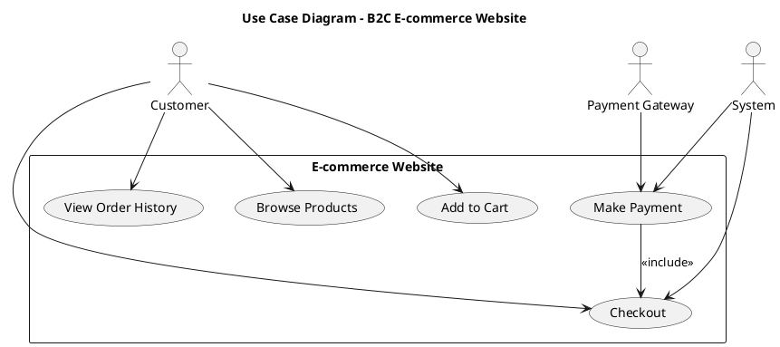
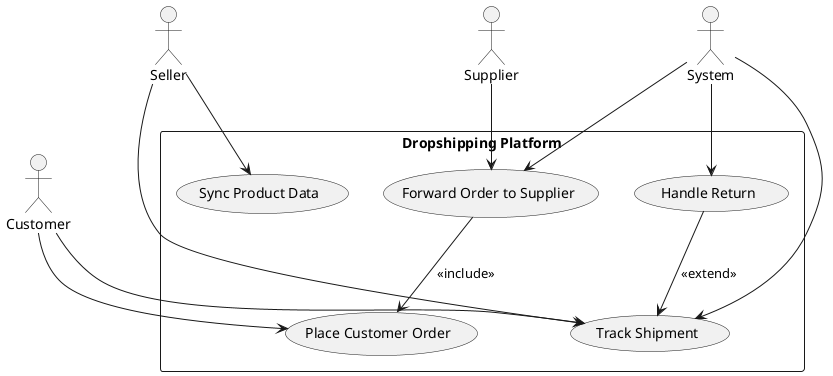

## 🧩 **Bài 1 – Đăng ký và đăng nhập (User Registration & Login)**

**FR-01:** The system shall allow customers to register, log in, and log out.
*(Hệ thống cho phép khách hàng đăng ký, đăng nhập và đăng xuất.)*

**Actors:** Customer, System

**Main Use Cases:**

* Register account *(Đăng ký tài khoản)*
* Login *(Đăng nhập)*
* Logout *(Đăng xuất)*

**Hint:** Include relationship between “Register” and “Verify Email.”
*(Gợi ý: Thêm mối quan hệ include giữa “Đăng ký” và “Xác minh email.”)*

---

## 🛒 **Bài 2 – Tìm kiếm và thêm sản phẩm vào giỏ hàng (Search & Add to Cart)**

**FR-02:** The customer can search products by name and add selected items to the cart.
*(Khách hàng có thể tìm sản phẩm theo tên và thêm vào giỏ hàng.)*

**Actors:** Customer, System

**Main Use Cases:**

* Search Product *(Tìm kiếm sản phẩm)*
* View Product Detail *(Xem chi tiết sản phẩm)*
* Add to Cart *(Thêm vào giỏ hàng)*

**Hint:** Use include between “Search Product” → “View Product Detail.”
*(Gợi ý: Thêm include giữa “Tìm kiếm sản phẩm” và “Xem chi tiết sản phẩm.”)*

---

## 💳 **Bài 3 – Thanh toán đơn hàng (Checkout and Payment)**

**FR-03:** The system allows customers to checkout, select payment methods, and confirm the order.
*(Hệ thống cho phép khách hàng thanh toán, chọn phương thức thanh toán và xác nhận đơn hàng.)*

**Actors:** Customer, System, Payment Gateway

**Main Use Cases:**

* Checkout *(Thanh toán)*
* Select Payment Method *(Chọn phương thức thanh toán)*
* Make Payment *(Thực hiện thanh toán)*
* Confirm Order *(Xác nhận đơn hàng)*

**Hint:** Include Payment Gateway in “Make Payment,” extend to “Cancel Payment.”
*(Gợi ý: Bao gồm Payment Gateway trong use case “Thực hiện thanh toán,” thêm extend cho “Hủy thanh toán.”)*

---

## 📦 **Bài 4 – Quản lý đơn hàng (Order Management)**

**FR-04:** Customers can view their orders, track delivery status, and request returns.
*(Khách hàng có thể xem đơn hàng, theo dõi tình trạng giao hàng, và yêu cầu trả hàng.)*

**Actors:** Customer, System, Logistics Provider

**Main Use Cases:**

* View Order History *(Xem lịch sử đơn hàng)*
* Track Shipment *(Theo dõi giao hàng)*
* Request Return *(Yêu cầu trả hàng)*
* Approve Return *(Xác nhận trả hàng)*

**Hint:** Use extend from “Track Shipment” to “Request Return.”
*(Gợi ý: Dùng extend từ “Theo dõi giao hàng” sang “Yêu cầu trả hàng.”)*

---

## ⭐ **Bài 5 – Quản lý đánh giá sản phẩm (Product Review Management)**

**FR-05:** Registered users can post reviews, give ratings, and report inappropriate comments.
*(Người dùng đã đăng ký có thể đăng đánh giá, chấm điểm, và báo cáo bình luận không phù hợp.)*

**Actors:** Customer, System, Admin

**Main Use Cases:**

* Write Review *(Viết đánh giá)*
* Rate Product *(Chấm điểm sản phẩm)*
* Report Review *(Báo cáo đánh giá)*
* Moderate Review *(Kiểm duyệt đánh giá)*

**Hint:** Extend from “Report Review” → “Moderate Review.”
*(Gợi ý: Dùng extend từ “Báo cáo đánh giá” sang “Kiểm duyệt đánh giá.”)*

Dưới đây là **5 bài tập vẽ full Use Case Diagram** cho các mô hình **hệ thống Thương mại điện tử (TMĐT)** phổ biến, được trình bày **song ngữ Việt – Anh (English in parentheses)**.
Các bài tập được sắp xếp từ **cơ bản đến nâng cao**, bao gồm **nhiều actor, mối quan hệ include/extend**, và có thể dùng cho sinh viên **vẽ sơ đồ Use Case hoàn chỉnh**.

---

### 🛒 **Bài 6 – B2C E-commerce Website (Trang TMĐT Bán hàng cho khách cá nhân)**

**Mức độ:** Dễ

**Mô tả (Description):**
Hệ thống cho phép khách hàng duyệt sản phẩm, thêm vào giỏ hàng, đặt hàng và thanh toán trực tuyến.
*(The system allows customers to browse products, add to cart, place orders, and pay online.)*

**Actors:**

* Customer (Khách hàng)
* System (Hệ thống)
* Payment Gateway (Cổng thanh toán)

**Use Cases:**

* Browse Products (Duyệt sản phẩm)
* Add to Cart (Thêm vào giỏ hàng)
* Checkout (Thanh toán đơn hàng)
* Make Payment (Thực hiện thanh toán) — *include → Checkout*
* View Order History (Xem lịch sử đơn hàng)

---

### 🏬 **Bài 7 – B2B Marketplace (Sàn giao dịch doanh nghiệp với doanh nghiệp)**

**Mức độ:** Trung bình

**Mô tả (Description):**
Hệ thống kết nối các doanh nghiệp mua và bán hàng hóa sỉ, có quản lý đơn hàng, báo giá và hợp đồng.
*(The system connects businesses for wholesale transactions, including order, quotation, and contract management.)*

**Actors:**

* Supplier (Nhà cung cấp)
* Buyer (Người mua doanh nghiệp)
* Admin (Quản trị viên)

**Use Cases:**

* Post Product Listings (Đăng sản phẩm)
* Request Quotation (Yêu cầu báo giá)
* Approve Contract (Phê duyệt hợp đồng)
* Manage Orders (Quản lý đơn hàng)
* Handle Disputes (Xử lý tranh chấp) — *extend → Manage Orders*

---

### 📦 **Bài 8 – Dropshipping Platform (Nền tảng bán hàng ký gửi)**

**Mức độ:** Trung bình – Khá

**Mô tả (Description):**
Nền tảng cho phép người bán đăng sản phẩm của nhà cung cấp và hệ thống tự động xử lý đơn hàng.
*(The platform enables sellers to list supplier products, and automatically forwards orders to suppliers.)*

**Actors:**

* Seller (Người bán)
* Supplier (Nhà cung cấp)
* Customer (Khách hàng)
* System (Hệ thống)

**Use Cases:**

* Sync Product Data (Đồng bộ dữ liệu sản phẩm)
* Place Customer Order (Khách hàng đặt hàng)
* Forward Order to Supplier (Chuyển đơn cho nhà cung cấp) — *include → Place Customer Order*
* Track Shipment (Theo dõi giao hàng)
* Handle Return (Xử lý trả hàng) — *extend → Track Shipment*

---

### 📱 **Bài 9 – Mobile Commerce App (Ứng dụng TMĐT di động)**

**Mức độ:** Khá – Nâng cao

**Mô tả (Description):**
Ứng dụng TMĐT hỗ trợ thanh toán qua ví điện tử, push notification và chương trình khách hàng thân thiết.
*(The mobile commerce app supports e-wallet payment, push notifications, and loyalty programs.)*

**Actors:**

* Mobile User (Người dùng di động)
* System (Hệ thống)
* Payment Service (Dịch vụ thanh toán)
* Loyalty Program (Chương trình khách hàng thân thiết)

**Use Cases:**

* Register/Login (Đăng ký/Đăng nhập)
* Browse and Search Products (Tìm kiếm sản phẩm)
* Add to Wishlist (Thêm vào danh sách yêu thích)
* Make Payment (Thanh toán) — *include → Checkout*
* Earn Reward Points (Nhận điểm thưởng) — *extend → Make Payment*
* Receive Notifications (Nhận thông báo)

---

### ☁️ **Bài 10 – Cloud-based SaaS E-commerce Solution (Giải pháp TMĐT SaaS dựa trên đám mây)**

**Mức độ:** Nâng cao

**Mô tả (Description):**
Hệ thống SaaS cho phép doanh nghiệp tạo và quản lý cửa hàng TMĐT riêng của họ trên nền tảng đám mây.
*(The SaaS system allows businesses to create and manage their own online stores on a cloud platform.)*

**Actors:**

* Store Owner (Chủ cửa hàng)
* Customer (Khách hàng)
* System (Nền tảng SaaS)
* Payment Gateway (Cổng thanh toán)
* Support Staff (Nhân viên hỗ trợ)

**Use Cases:**

* Create Online Store (Tạo cửa hàng trực tuyến)
* Manage Products and Inventory (Quản lý sản phẩm và tồn kho)
* Configure Payment Options (Cấu hình phương thức thanh toán)
* Process Customer Orders (Xử lý đơn hàng)
* Access Analytics Dashboard (Xem bảng điều khiển phân tích)
* Request Technical Support (Yêu cầu hỗ trợ kỹ thuật) — *extend → Manage Store*

-----------------------------------------------------------
# MÔ TẢ CHI TIẾT CÁC BÀI TẬP NÂNG CAO 6-10

---

# Bài 6 – B2C E-commerce Website (Trang TMĐT Bán hàng cho khách cá nhân)

### 🔹 **Loại mô hình:** Use Case Diagram

### 🔹 **Mục tiêu học tập (Learning Objective):**

Sinh viên hiểu cách mô hình hóa các chức năng chính trong một hệ thống thương mại điện tử B2C từ góc nhìn người dùng cuối.

---

## 🧩 **1. Mô tả hệ thống (System Description)**

**English:** The system allows customers to browse products, add items to a shopping cart, place an order, and make online payments.
**Tiếng Việt:** Hệ thống cho phép khách hàng duyệt sản phẩm, thêm sản phẩm vào giỏ hàng, đặt hàng và thanh toán trực tuyến.

---

## 👥 **2. Actors (Tác nhân)**

| Actor                                 | Description (Mô tả)                                                                                       |
| ------------------------------------- | --------------------------------------------------------------------------------------------------------- |
| **Customer (Khách hàng)**             | Người dùng cuối truy cập trang TMĐT để mua hàng.                                                          |
| **System (Hệ thống)**                 | Thành phần nội bộ chịu trách nhiệm xử lý logic nghiệp vụ, lưu trữ dữ liệu, và quản lý quy trình đặt hàng. |
| **Payment Gateway (Cổng thanh toán)** | Dịch vụ trung gian thực hiện giao dịch thanh toán trực tuyến an toàn.                                     |

---

## ⚙️ **3. Use Cases (Các trường hợp sử dụng)**

| Use Case                                      | Description (Mô tả)                                                   | Relation             |
| --------------------------------------------- | --------------------------------------------------------------------- | -------------------- |
| **Browse Products (Duyệt sản phẩm)**          | Cho phép khách hàng xem danh sách và chi tiết sản phẩm.               | —                    |
| **Add to Cart (Thêm vào giỏ hàng)**           | Khách hàng thêm sản phẩm muốn mua vào giỏ hàng.                       | —                    |
| **Checkout (Thanh toán đơn hàng)**            | Khách hàng xác nhận giỏ hàng, nhập thông tin giao hàng và đặt hàng.   | —                    |
| **Make Payment (Thực hiện thanh toán)**       | Khách hàng thực hiện thanh toán trực tuyến thông qua cổng thanh toán. | *include → Checkout* |
| **View Order History (Xem lịch sử đơn hàng)** | Khách hàng xem lại các đơn hàng đã thực hiện.                         | —                    |

---

## 🔄 **4. Relationships (Các mối quan hệ)**

| Type                         | Description                                                                                        |
| ---------------------------- | -------------------------------------------------------------------------------------------------- |
| **Include**                  | `Make Payment` bao gồm trong `Checkout` vì thanh toán là một phần không thể tách rời khi đặt hàng. |
| **Association**              | Customer kết nối với tất cả các Use Case ngoại trừ các xử lý hệ thống nội bộ.                      |
| **System – Payment Gateway** | Thực hiện gọi API tới cổng thanh toán khi xử lý `Make Payment`.                                    |

---

## 📊 **5. Use Case Diagram (PlantUML Code)**

---

## 🧠 **6. Giải thích sơ đồ (Explanation)**

| Thành phần                            | Ý nghĩa                                                                                      |
| ------------------------------------- | -------------------------------------------------------------------------------------------- |
| **Customer**                          | Tác nhân chính, thực hiện toàn bộ các hành vi người dùng.                                    |
| **System**                            | Hệ thống TMĐT xử lý quy trình checkout, lưu trữ đơn hàng.                                    |
| **Payment Gateway**                   | Cổng thanh toán thực hiện giao dịch tài chính qua API.                                       |
| **Include (Checkout → Make Payment)** | Hành vi thanh toán là phần mở rộng trong bước checkout, do đó được mô hình hóa là *include*. |

---

## 🧩 **7. Mô tả Use Case chính (Checkout)**

| Thuộc tính                              | Nội dung                                                                                                                                                                                                                                                      |
| --------------------------------------- | ------------------------------------------------------------------------------------------------------------------------------------------------------------------------------------------------------------------------------------------------------------- |
| **Tên (Name)**                          | Checkout (Thanh toán đơn hàng)                                                                                                                                                                                                                                |
| **Actor chính**                         | Customer                                                                                                                                                                                                                                                      |
| **Mô tả (Description)**                 | Cho phép khách hàng xác nhận giỏ hàng, nhập thông tin giao hàng, và tiến hành thanh toán.                                                                                                                                                                     |
| **Luồng chính (Main Flow)**             | 1. Khách hàng mở giỏ hàng. 2. Hệ thống hiển thị sản phẩm và tổng tiền. 3. Khách hàng nhập địa chỉ giao hàng. 4. Khách hàng chọn phương thức thanh toán. 5. Hệ thống gọi Payment Gateway để xử lý. 6. Đơn hàng được lưu và xác nhận thành công. |
| **Luồng thay thế (Alternative Flow)**   | 5a. Nếu thanh toán thất bại, hệ thống hiển thị thông báo lỗi.                                                                                                                                                                                                 |
| **Điều kiện tiên quyết (Precondition)** | Khách hàng đã đăng nhập và có sản phẩm trong giỏ hàng.                                                                                                                                                                                                        |
| **Kết quả (Postcondition)**             | Đơn hàng được lưu trong hệ thống, trạng thái thanh toán cập nhật thành công.                                                                                                                                                                                  |

---

## 💡 **8. Gợi ý mở rộng (Advanced tasks)**

* Thêm Use Case “Cancel Order” (Hủy đơn hàng) — *extend → View Order History*.
* Tách phần “Shipping Service” làm actor riêng khi mô hình hóa hệ thống lớn hơn.
* Thiết kế Sequence Diagram từ Use Case “Checkout”.

---

# Bài 7: B2B Marketplace (Sàn giao dịch doanh nghiệp với doanh nghiệp)

---

## 🎯 **1. Mục tiêu bài toán**

Mô hình hóa các chức năng chính của **sàn giao dịch B2B**, nơi:

* **Nhà cung cấp (Supplier)** có thể đăng bán hàng hóa.
* **Người mua doanh nghiệp (Buyer)** có thể gửi yêu cầu báo giá và đặt hàng.
* **Quản trị viên (Admin)** giám sát, duyệt hợp đồng và xử lý tranh chấp.

---

## 🧩 **2. Các Actor**

| Actor                       | Vai trò chính                                          |
| --------------------------- | ------------------------------------------------------ |
| **Supplier (Nhà cung cấp)** | Đăng danh mục hàng hóa, phản hồi báo giá, ký hợp đồng. |
| **Buyer (Người mua)**       | Gửi yêu cầu báo giá, quản lý đơn hàng, ký hợp đồng.    |
| **Admin (Quản trị viên)**   | Phê duyệt hợp đồng, xử lý tranh chấp giữa các bên.     |

---

## ⚙️ **3. Các Use Case**

| Use Case                  | Mô tả                                                             | Liên quan                      |
| ------------------------- | ----------------------------------------------------------------- | ------------------------------ |
| **Post Product Listings** | Nhà cung cấp đăng sản phẩm để bán.                                | Supplier                       |
| **Request Quotation**     | Người mua yêu cầu báo giá cho sản phẩm.                           | Buyer                          |
| **Approve Contract**      | Quản trị viên xem xét và phê duyệt hợp đồng.                      | Admin                          |
| **Manage Orders**         | Cả Supplier và Buyer quản lý đơn hàng đã ký kết.                  | Supplier, Buyer                |
| **Handle Disputes**       | Quản trị viên can thiệp khi có tranh chấp giữa Buyer và Supplier. | Admin → *extend* Manage Orders |

---

## 📘 **4. Quan hệ giữa các Use Case**

* `Handle Disputes` **extend** `Manage Orders`:
  Khi có tranh chấp về đơn hàng, hệ thống mở rộng quy trình quản lý đơn hàng để xử lý khiếu nại.

---

## 📄 **6. Phân tích chi tiết**

| Actor        | Tương tác với Use Case                   | Ý nghĩa                                  |
| ------------ | ---------------------------------------- | ---------------------------------------- |
| **Supplier** | `Post Product Listings`, `Manage Orders` | Quản lý hàng hóa và đơn hàng.            |
| **Buyer**    | `Request Quotation`, `Manage Orders`     | Gửi yêu cầu báo giá và theo dõi đơn.     |
| **Admin**    | `Approve Contract`, `Handle Disputes`    | Kiểm soát hợp đồng và đảm bảo công bằng. |

---

## 💡 **7. Gợi ý mở rộng**

* Có thể thêm `Generate Invoice` (Tạo hóa đơn) và `Payment Management` (Quản lý thanh toán) để hoàn thiện hệ thống thực tế.
* Với hệ thống phức tạp, nên phân rã `Manage Orders` thành các use case con như:

  * `Create Order`
  * `Update Order Status`
  * `Cancel Order`

---

Dưới đây là **lời giải đầy đủ cho bài tập vẽ Use Case Diagram**:

---

# 🎯 **Bài 8 – Dropshipping Platform (Nền tảng bán hàng ký gửi)**

### 🧩 **1. Mô tả tổng quan (Overview)**

The system acts as a middle layer between **Customer**, **Seller**, and **Supplier**.
When a customer places an order, the **System** automatically forwards it to the **Supplier**, who ships the item directly to the customer.

(Hệ thống đóng vai trò trung gian giữa **Khách hàng**, **Người bán**, và **Nhà cung cấp**.
Khi khách hàng đặt hàng, **Hệ thống** sẽ tự động chuyển đơn cho **Nhà cung cấp** để họ giao hàng trực tiếp cho khách.)

---

### 👥 **2. Actors (Tác nhân)**

| Actor (Tiếng Anh) | Tác nhân (Tiếng Việt) | Vai trò                                    |
| ----------------- | --------------------- | ------------------------------------------ |
| **Customer**      | Khách hàng            | Đặt hàng và theo dõi giao hàng             |
| **Seller**        | Người bán             | Liên kết với nhà cung cấp và đăng sản phẩm |
| **Supplier**      | Nhà cung cấp          | Cung cấp và giao sản phẩm                  |
| **System**        | Hệ thống              | Xử lý đồng bộ, chuyển đơn, và theo dõi     |

---

### 🎬 **3. Use Cases (Các trường hợp sử dụng)**

| Use Case                                                    | Diễn giải                                                              | Ghi chú                          |
| ----------------------------------------------------------- | ---------------------------------------------------------------------- | -------------------------------- |
| **Sync Product Data** (Đồng bộ dữ liệu sản phẩm)            | Người bán đồng bộ sản phẩm từ nhà cung cấp lên nền tảng.               | Seller ↔ System                  |
| **Place Customer Order** (Khách hàng đặt hàng)              | Khách hàng chọn sản phẩm và đặt hàng qua nền tảng.                     | Customer ↔ System                |
| **Forward Order to Supplier** (Chuyển đơn cho nhà cung cấp) | Hệ thống tự động gửi đơn hàng đến nhà cung cấp sau khi khách hàng đặt. | include → *Place Customer Order* |
| **Track Shipment** (Theo dõi giao hàng)                     | Khách hàng hoặc người bán có thể theo dõi quá trình vận chuyển.        | Customer ↔ System                |
| **Handle Return** (Xử lý trả hàng)                          | Khi hàng bị lỗi hoặc hủy, hệ thống xử lý hoàn trả với nhà cung cấp.    | extend → *Track Shipment*        |

---

### ⚙️ **4. Quan hệ giữa các Use Case (Relationships)**

* **Forward Order to Supplier** → `<<include>>` → **Place Customer Order**
  *(Vì chuyển đơn chỉ xảy ra sau khi khách hàng đặt hàng)*
* **Handle Return** → `<<extend>>` → **Track Shipment**
  *(Vì xử lý trả hàng chỉ xảy ra nếu có vấn đề trong quá trình giao)*

---

### 🧭 **5. Sơ đồ Use Case (PlantUML)**

---

### 📘 **6. Diễn giải sơ đồ (Explanation)**

* **Customer** tương tác chính với hệ thống để **đặt hàng** và **theo dõi giao hàng**.
* **Seller** đăng sản phẩm thông qua **đồng bộ dữ liệu sản phẩm (Sync Product Data)**.
* **System** đảm nhiệm **chuyển đơn hàng** đến **Supplier** và **xử lý trả hàng** khi cần.
* **Supplier** chỉ nhận đơn từ hệ thống, không trực tiếp tương tác với khách hàng.

---

# Bài 9: Mobile Commerce App (Ứng dụng TMĐT di động)

---

## 🎯 **1. Mục tiêu bài toán**

Ứng dụng **Mobile Commerce App** (m-commerce) cung cấp các chức năng chính của TMĐT trên thiết bị di động, với **tích hợp thanh toán ví điện tử**, **thông báo đẩy**, và **chương trình khách hàng thân thiết (loyalty)**.
Người dùng có thể đăng ký, duyệt sản phẩm, lưu yêu thích, thanh toán và nhận điểm thưởng.

---

## 🧩 **2. Các Actor**

| Actor                                                    | Vai trò    | Mô tả                                                                              |
| -------------------------------------------------------- | ---------- | ---------------------------------------------------------------------------------- |
| **Mobile User (Người dùng di động)**                     | Chính      | Người dùng tương tác với ứng dụng, duyệt sản phẩm và thực hiện mua hàng.           |
| **System (Hệ thống)**                                    | Trung gian | Xử lý logic nghiệp vụ, gửi thông báo và quản lý quy trình thanh toán, điểm thưởng. |
| **Payment Service (Dịch vụ thanh toán)**                 | Ngoại vi   | Cung cấp cổng thanh toán điện tử, ví điện tử.                                      |
| **Loyalty Program (Chương trình khách hàng thân thiết)** | Ngoại vi   | Quản lý điểm thưởng, cấp quyền lợi cho người dùng.                                 |

---

## ⚙️ **3. Các Use Case chính**

| Use Case                       | Mô tả                                                          | Liên quan                               |
| ------------------------------ | -------------------------------------------------------------- | --------------------------------------- |
| **Register/Login**             | Người dùng đăng ký tài khoản mới hoặc đăng nhập vào hệ thống.  | Mobile User                             |
| **Browse and Search Products** | Duyệt và tìm kiếm sản phẩm.                                    | Mobile User                             |
| **Add to Wishlist**            | Lưu sản phẩm yêu thích để xem hoặc mua sau.                    | Mobile User                             |
| **Checkout**                   | Xác nhận giỏ hàng và thông tin giao hàng trước khi thanh toán. | Mobile User, System                     |
| **Make Payment**               | Thực hiện thanh toán qua ví điện tử.                           | Mobile User, Payment Service, System    |
| **Earn Reward Points**         | Nhận điểm thưởng sau khi thanh toán thành công.                | Loyalty Program → *extend* Make Payment |
| **Receive Notifications**      | Hệ thống gửi thông báo đẩy về đơn hàng, khuyến mãi.            | System, Mobile User                     |

---

## 🔁 **4. Quan hệ giữa các Use Case**

* `Make Payment` **include → Checkout**
  ⇒ Thanh toán chỉ xảy ra **sau khi** người dùng hoàn tất bước kiểm tra giỏ hàng và xác nhận đơn hàng.

* `Earn Reward Points` **extend → Make Payment**
  ⇒ Khi thanh toán thành công, hệ thống **mở rộng** quy trình để cộng điểm thưởng.

---

## 📄 **6. Phân tích chi tiết quan hệ**

| Actor               | Use Case tương tác                                                                            | Mô tả vai trò                                      |
| ------------------- | --------------------------------------------------------------------------------------------- | -------------------------------------------------- |
| **Mobile User**     | Register/Login, Browse/Search, Add to Wishlist, Checkout, Make Payment, Receive Notifications | Người sử dụng ứng dụng m-commerce.                 |
| **System**          | Checkout, Make Payment, Receive Notifications                                                 | Quản lý quy trình nghiệp vụ và xử lý logic nội bộ. |
| **Payment Service** | Make Payment                                                                                  | Thực hiện giao dịch tài chính qua ví điện tử.      |
| **Loyalty Program** | Earn Reward Points                                                                            | Ghi nhận và cập nhật điểm thưởng.                  |

---

## 📘 **7. Luồng nghiệp vụ chính (Business Flow)**

1. Người dùng **đăng nhập** hoặc **đăng ký** tài khoản.
2. **Duyệt / Tìm kiếm sản phẩm** mong muốn.
3. **Thêm sản phẩm vào danh sách yêu thích** hoặc giỏ hàng.
4. Thực hiện **Checkout** để xác nhận đơn hàng.
5. Hệ thống gọi **Payment Service** để xử lý **Make Payment**.
6. Nếu giao dịch thành công, **Loyalty Program** được gọi để **cộng điểm thưởng (Earn Reward Points)**.
7. Hệ thống gửi **Push Notification** cho người dùng về đơn hàng và ưu đãi mới.

---

## 🌟 **8. Gợi ý mở rộng**

* Thêm các use case nâng cao như:

  * `Track Delivery` (Theo dõi giao hàng)
  * `Review Product` (Đánh giá sản phẩm)
  * `Redeem Reward Points` (Đổi điểm lấy ưu đãi)
* Tích hợp thêm **AI Recommendation System** để gợi ý sản phẩm.

---

# Bài 10 – Cloud-based SaaS E-commerce Solution (Giải pháp TMĐT SaaS dựa trên đám mây)

**Mức độ:** Nâng cao

---

## 🧭 **1. Mô tả tổng quan (Overview)**

**Mô tả (Description):**
Hệ thống **SaaS E-commerce Platform** cho phép các doanh nghiệp hoặc cá nhân tạo **cửa hàng trực tuyến riêng** trên nền tảng đám mây, quản lý sản phẩm, xử lý đơn hàng và cấu hình các phương thức thanh toán. Ngoài ra, hệ thống cung cấp **bảng phân tích dữ liệu (analytics)** và **hỗ trợ kỹ thuật trực tuyến**.

**(The SaaS platform enables businesses to create and manage their own online stores on the cloud, handle orders, configure payments, and access analytics tools with optional technical support.)**

---

## 👥 **2. Actors (Tác nhân)**

| **Actor**                             | **Mô tả (Description)**                                            |
| ------------------------------------- | ------------------------------------------------------------------ |
| **Store Owner (Chủ cửa hàng)**        | Người dùng chính của hệ thống, tạo và quản lý cửa hàng trực tuyến. |
| **Customer (Khách hàng)**             | Người mua hàng trong các cửa hàng TMĐT được tạo trên nền tảng.     |
| **System (Nền tảng SaaS)**            | Hệ thống xử lý và cung cấp hạ tầng SaaS, tự động hóa quy trình.    |
| **Payment Gateway (Cổng thanh toán)** | Hệ thống bên thứ ba xử lý giao dịch thanh toán trực tuyến.         |
| **Support Staff (Nhân viên hỗ trợ)**  | Cung cấp hỗ trợ kỹ thuật và xử lý sự cố cho các cửa hàng.          |

---

## ⚙️ **3. Use Cases (Các trường hợp sử dụng)**

| **Use Case**                                                                      | **Mô tả (Description)**                                               |
| --------------------------------------------------------------------------------- | --------------------------------------------------------------------- |
| **Create Online Store (Tạo cửa hàng trực tuyến)**                                 | Store Owner đăng ký và khởi tạo cửa hàng riêng trên nền tảng.         |
| **Manage Products and Inventory (Quản lý sản phẩm và tồn kho)**                   | Cập nhật, thêm, xóa sản phẩm và quản lý lượng tồn.                    |
| **Configure Payment Options (Cấu hình phương thức thanh toán)**                   | Thiết lập kết nối với cổng thanh toán (ví điện tử, thẻ tín dụng).     |
| **Process Customer Orders (Xử lý đơn hàng)**                                      | Nhận và xử lý đơn hàng từ khách hàng.                                 |
| **Access Analytics Dashboard (Xem bảng điều khiển phân tích)**                    | Xem báo cáo doanh thu, số lượng khách hàng, hành vi mua hàng.         |
| **Request Technical Support (Yêu cầu hỗ trợ kỹ thuật)** — *extend → Manage Store* | Khi có sự cố, chủ cửa hàng gửi yêu cầu hỗ trợ đến nhân viên kỹ thuật. |

---

## 🔁 **4. Mối quan hệ giữa các Use Case**

* **Request Technical Support** → `extend` → **Manage Store**
  ➜ Khi chủ cửa hàng gặp lỗi trong quá trình quản lý cửa hàng (ví dụ: cấu hình sai thanh toán, không cập nhật được sản phẩm), họ có thể mở rộng quy trình bằng cách gửi yêu cầu hỗ trợ.

* **Process Customer Orders** có thể **include → Configure Payment Options**
  ➜ Mỗi đơn hàng cần xác nhận cổng thanh toán đã được thiết lập.

## 📋 **5. Luồng nghiệp vụ chính (Main Business Flow)**

1. **Store Owner** đăng ký và **tạo cửa hàng trực tuyến** mới trên nền tảng (Create Online Store).
2. Sau khi tạo, họ tiến hành **quản lý sản phẩm và tồn kho** (Manage Products and Inventory).
3. Tiếp theo, họ **cấu hình phương thức thanh toán** với **Payment Gateway**.
4. Khi **Customer** đặt hàng, hệ thống **xử lý đơn hàng** (Process Customer Orders).
5. Mọi giao dịch thanh toán được **hệ thống SaaS** chuyển qua **Payment Gateway**.
6. **Store Owner** có thể **xem báo cáo và phân tích** qua dashboard.
7. Khi có sự cố (ví dụ lỗi thanh toán, lỗi API), họ **gửi yêu cầu hỗ trợ kỹ thuật (Request Technical Support)** → được **Support Staff** xử lý.

---

## 🧩 **6. Phân tích tác nhân và tương tác**

| **Actor**           | **Use Case liên quan**       | **Mô tả chi tiết vai trò**                             |
| ------------------- | ---------------------------- | ------------------------------------------------------ |
| **Store Owner**     | UC1, UC2, UC3, UC4, UC5, UC6 | Người tạo cửa hàng, vận hành và theo dõi doanh thu.    |
| **Customer**        | UC4                          | Khách mua hàng, tương tác gián tiếp với hệ thống SaaS. |
| **System**          | UC3, UC4, UC5                | Xử lý giao dịch, quản lý dữ liệu và báo cáo.           |
| **Payment Gateway** | UC3, UC4                     | Xử lý giao dịch thanh toán.                            |
| **Support Staff**   | UC6                          | Tiếp nhận yêu cầu hỗ trợ kỹ thuật.                     |

---

## 📊 **7. Liên hệ thực tế (Real-world Examples)**

| **Nền tảng**              | **Ứng dụng tương tự bài toán**                                             |
| ------------------------- | -------------------------------------------------------------------------- |
| **Shopify**               | Cho phép người bán tạo cửa hàng riêng, cấu hình thanh toán và xem báo cáo. |
| **Odoo eCommerce (SaaS)** | Cung cấp giải pháp quản trị bán hàng, kho, CRM và hỗ trợ kỹ thuật.         |
| **BigCommerce Cloud**     | SaaS E-commerce tích hợp thanh toán, phân tích và quản lý sản phẩm.        |

---

## 💡 **8. Gợi ý mở rộng Use Case**

* `Integrate Marketing Tools` – Tích hợp công cụ quảng cáo / email marketing.
* `Multi-store Management` – Quản lý nhiều cửa hàng trong cùng tài khoản.
* `Custom Domain Setup` – Cho phép chủ cửa hàng cấu hình tên miền riêng.
* `Automated Backup` – Tự động sao lưu dữ liệu cửa hàng trên cloud.

---

## ✅ **9. Tóm tắt ý nghĩa sơ đồ**

* Mô hình hóa mối quan hệ **đa tác nhân (multi-actor)** trong **một hệ thống SaaS phức tạp**.
* Thể hiện sự **phối hợp giữa tác nhân nội bộ (System)** và **ngoại vi (Payment Gateway, Support Staff)**.
* Kết hợp **include / extend** để minh họa luồng xử lý mở rộng và tái sử dụng trong Use Case.

