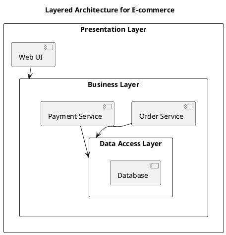
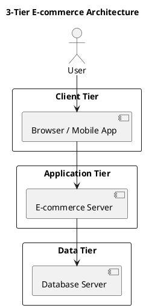
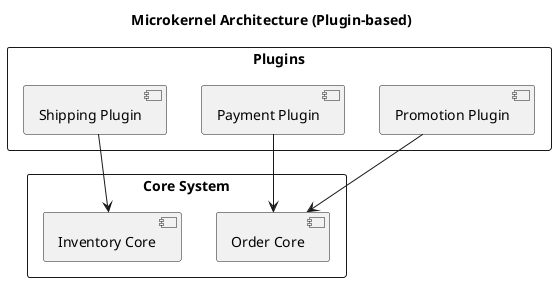

## 🎓 **ĐỒ ÁN MÔN HỌC: THIẾT KẾ HỆ THỐNG THƯƠNG MẠI ĐIỆN TỬ**

---

### **Trang bìa (Cover Page)**

* Tên môn học: *Thiết kế hệ thống Thương mại điện tử*
* Tên đề tài: *Ví dụ: Thiết kế hệ thống B2C bán mỹ phẩm trực tuyến*
* Nhóm sinh viên: Họ tên – MSSV
* Giảng viên hướng dẫn: …
* Ngày nộp: …

---

### Thông tin nhóm (Team Information)

| Thành viên | MSSV | Vai trò (Role)            | Ghi chú |
| ---------- | ---- | ------------------------- | ------- |
| 1.         |      | Nhóm trưởng (Team Leader) |         |
| 2.         |      | Thành viên (Member)       |         |
| 3.         |      | Thành viên (Member)       |         |
| 4.         |      | Thành viên (Member)       |         |
| 5.         |      | Thành viên (Member)       |         |
| 6.         |      | Thành viên (Member)       |         |

> *Nhóm tối đa 6 sinh viên. Mỗi sinh viên chọn 1 Requirement cụ thể để thực hiện phân tích & thiết kế chi tiết.*
> 
---

### **1. Giới thiệu (Introduction)**

* **Lý do chọn đề tài**
  Mô tả ngắn gọn ý tưởng và phạm vi hệ thống TMĐT mà nhóm chọn, mục tiêu kinh doanh, giá trị mang lại, và đối tượng người dùng.
*(Describe the overall system, business goals, value proposition, and user audience.)*
* **Mục tiêu nghiên cứu**  
* **Phạm vi hệ thống**
* **Cấu trúc báo cáo**

---

### **2. Phân tích yêu cầu (Requirement Analysis)**

* **2.1. Mô tả bài toán (Problem Statement)**
  
* **2.2. Các yêu cầu chức năng (Functional Requirements)**
Liệt kê 5–10 yêu cầu chức năng chính.
*(List 5–10 main functional requirements.)*

| ID    | Requirement               | Mô tả (Description)                      |
| ----- | ------------------------- | ---------------------------------------- |
| FR-01 | User Registration & Login | Cho phép người dùng đăng ký và đăng nhập |
| FR-02 | Product Management        | Quản lý sản phẩm                         |
| FR-03 | Order Management          | Quản lý đơn hàng                         |
| FR-04 | Payment Processing        | Xử lý thanh toán                         |
| FR-05 | Customer Review           | Người dùng đánh giá sản phẩm             |

* **2.3. Các yêu cầu phi chức năng (Non-functional Requirements)**
  
| ID     | Requirement  | Mô tả                          |
| ------ | ------------ | ------------------------------ |
| NFR-01 | Performance  | Thời gian phản hồi dưới 3 giây |
| NFR-02 | Security     | Dữ liệu người dùng được mã hóa |
| NFR-03 | Availability | Hệ thống hoạt động 24/7        |

---

### **3. Mô hình hóa hệ thống (System Modeling)**

> Mỗi sinh viên hoặc nhóm nhỏ (1–2 người) chọn **1 chức năng chính** để mô hình hóa đầy đủ.

#### **3.1. Biểu đồ hoạt động / BPMN (Activity Diagram / BPMN Diagram)**

* Mô hình hóa quy trình nghiệp vụ chính (ví dụ: Đặt hàng, Thanh toán, Vận chuyển, Xử lý hoàn trả...).
* Có các bước (activity), điều kiện (decision), và tác nhân tham gia.

#### **3.2. Biểu đồ Use Case tổng thể (Use Case Diagram)**

* Vẽ sơ đồ Use Case tổng thể hệ thống.
* Mỗi sinh viên chọn 1 Use Case chi tiết để đặc tả đầy đủ.

**Ví dụ:**
Use Case: “Place Order”

* Actors: Customer, System, Payment Gateway
* Includes: “Validate Cart”, “Process Payment”
* Extends: “Cancel Order”

### 3.3 Đặc tả Use Case (Use case Specification)

Mỗi sinh viên viết đặc tả chi tiết cho 1 Use Case:

| Mục             | Nội dung |
| --------------- | -------- |
| Use Case ID     | FR-XX    |
| Use Case Name   |          |
| Actors          |          |
| Pre-conditions  |          |
| Post-conditions |          |
| Main Flow       |          |
| Alternate Flow  |          |
| Exception Flow  |          |


#### **3.4. Biểu đồ lớp (Class Diagram)**

* Xác định các lớp (entities, controllers, services, models).
* Biểu diễn quan hệ giữa các lớp: Association, Aggregation, Composition, Inheritance.

#### **3.5. Biểu đồ trình tự (Sequence Diagram)**

* Vẽ sơ đồ tuần tự thể hiện luồng tương tác giữa các đối tượng khi thực hiện 1 Use Case cụ thể.

---

### **4. Thiết kế hệ thống (System Design)**

#### **4.1. Kiến trúc hệ thống (System Architecture)**

* Mô tả mô hình kiến trúc (Layered, Tiered, hoặc Microservices)
* Sơ đồ kiến trúc tổng thể (PlantUML / Draw.io / Lucidchart, v.v.)
* Mô tả các thành phần chính (Frontend, Backend, Database, API, Payment Gateway, v.v.)
*(Present the overall architecture design that supports scalability, modularity, and maintainability.)*

| Kiến trúc                      | Mô tả (Description)                                            | Ví dụ trong TMĐT                               |
| ------------------------------ | -------------------------------------------------------------- | ---------------------------------------------- |
| **Monolithic**                 | Tất cả chức năng gói trong một ứng dụng duy nhất.              | Website TMĐT nhỏ (PHP, Laravel, WordPress)     |
| **Layered Architecture**       | Phân tầng Presentation – Business – Data.                      | Shopee Web App (Frontend + Service Layer + DB) |
| **Tiered Architecture**        | Tách tầng theo triển khai vật lý (Client / Server / Database). | Hệ thống đặt hàng web + API server + DB        |
| **Microservices**              | Mỗi dịch vụ độc lập, giao tiếp qua API.                        | Shopify, Amazon, Tiki                          |
| **Microkernel (Plugin-based)** | Lõi hệ thống mở rộng qua plugin.                               | Odoo E-commerce, Magento                       |
| **Cloud-based / SaaS**         | Ứng dụng triển khai trên đám mây.                              | Shopify Cloud, Salesforce Commerce Cloud       |

### Sơ đồ kiến trúc mẫu (Architecture Diagram Examples)

#### (a) Layered Architecture



#### (b) Tiered Architecture



#### (c) Microkernel (Plugin-based)



#### **4.2. Thiết kế cơ sở dữ liệu (Database Design)**

* Mô hình ERD (Entity Relationship Diagram).
* Thiết kế bảng, khóa chính – khóa ngoại, và mối quan hệ.

**Ví dụ:**

| Table  | Fields                                   | Description              |
| ------ | ---------------------------------------- | ------------------------ |
| Users  | user_id (PK), name, email, password      | Lưu thông tin người dùng |
| Orders | order_id (PK), user_id (FK), date, total | Thông tin đơn hàng       |


#### **4.3. Thiết kế giao diện, trải nghiệm người dùng (UI/UX Design)**

* Thiết kế các giao diện chính (Home, Product Detail, Cart, Checkout, Admin Dashboard…).
* Logic điều hướng và trải nghiệm người dùng
* Có thể dùng Figma / Canva / PowerPoint / HTML mockup.

---

### **5. Demo & Báo cáo (Demo & Reporting)**

* Một số màn hình demo chính hoặc mô phỏng chức năng (prototype hoặc web nhỏ) tập trung vào **các chức năng chính (Use Case)** mà sinh viên chọn.  
* Có thể dùng: HTML/CSS, Figma, Laravel, Django, Node.js, React, Flutter, hoặc No-code tool (Wix, Shopify, WooCommerce)

---

### **6. Kết luận và hướng phát triển (Conclusion & Future Work)**

* Kết quả đạt được (Tóm tắt những gì đã hoàn thành so với yêu cầu ban đầu)
* Đề xuất hướng phát triển hoặc mở rộng (ví dụ: tích hợp AI chatbot, cá nhân hóa sản phẩm, v.v.)

---

### **7. Tài liệu tham khảo (References)**

* Sách, bài báo, website, tài liệu UML, hoặc hệ thống tham khảo.
* Ví dụ:

  ```
  [1] Kenneth C. Laudon, Carol Traver, *E-Commerce 2024: Business, Technology, Society*, Pearson.
  [2] UML Diagrams Tutorial, Visual Paradigm, 2023.
  [3] Shopify Architecture Overview – Shopify Engineering Blog.
  ```

---

### **Phụ lục (Appendix)**

* Biểu đồ đầy đủ (PlantUML code, ERD, Mockup UI, hoặc API list).
* Nhật ký làm việc nhóm.

---

### ✅ **Yêu cầu nộp bài (Submission Requirements)**
* Nhóm **tối đa 6 sinh viên**.
* Mỗi thành viên chịu trách nhiệm **phân tích – thiết kế một chức năng riêng**.
* Có **sơ đồ Use Case tổng hợp** toàn hệ thống.

| Mục             | Yêu cầu                               |
| --------------- | ------------------------------------- |
| File báo cáo    | .docx và .pdf                       |
| File thiết kế   | .puml, .png hoặc .jpg                 |
| Demo (tùy chọn) | Video hoặc Link chạy thử              |
| Deadline        |                                       |
| Nộp tại         | LMS / Google Drive / Email giảng viên |


---

## GỢI Ý MỤC TIÊU NGHIÊN CỨU (RESEARCH OBJECTIVES) CHO CHỦ ĐỀ  THIẾT KẾ HỆ THỐNG THƯƠNG MẠI ĐIỆN TỬ

### 🎯 **I. Mục tiêu tổng quát (General Objective)**

> Nghiên cứu, phân tích và thiết kế một hệ thống Thương mại điện tử nhằm hỗ trợ hoạt động giao dịch, mua bán hàng hóa/dịch vụ trên nền tảng trực tuyến, đáp ứng yêu cầu thực tiễn và đảm bảo khả năng mở rộng, bảo mật, và trải nghiệm người dùng.

---

### 🎯 **II. Mục tiêu cụ thể (Specific Objectives)**

#### **1. Mức độ cơ bản (Basic Level)**

Dành cho đồ án thiên về **phân tích & thiết kế hệ thống**

* Phân tích yêu cầu người dùng và xác định các chức năng chính của hệ thống TMĐT.
* Thiết kế các mô hình **Use Case, Class, Sequence, Activity Diagram** để mô tả logic nghiệp vụ.
* Thiết kế cơ sở dữ liệu quan hệ (ERD) hỗ trợ các nghiệp vụ mua bán trực tuyến.
* Xây dựng giao diện người dùng (UI) thân thiện, phù hợp với trải nghiệm khách hàng (UX).
* Trình bày kiến trúc hệ thống (System Architecture) theo hướng **Layered hoặc Tiered**.

---

#### **2. Mức độ ứng dụng (Applied Level)**

Dành cho đồ án có yếu tố **phát triển và thử nghiệm sản phẩm mẫu (prototype)**

* Phát triển mô hình mẫu hệ thống TMĐT (Web hoặc Mobile) sử dụng ngôn ngữ lập trình hiện đại (VD: Laravel, Node.js, React, Flutter...).
* Ứng dụng **kiến trúc Microservices hoặc Microkernel** để tăng khả năng mở rộng hệ thống.
* Tích hợp **cổng thanh toán trực tuyến (Online Payment Gateway)** và **chức năng quản lý đơn hàng (Order Management)**.
* Kiểm thử chức năng và đánh giá hiệu năng cơ bản của hệ thống.
* Đề xuất hướng cải tiến nhằm nâng cao trải nghiệm người dùng hoặc tối ưu quy trình bán hàng.

---

#### **3. Mức độ nâng cao (Advanced / Research Level)**

Dành cho đề tài có yếu tố **nghiên cứu – đổi mới sáng tạo**

* Nghiên cứu ứng dụng **AI/ML trong cá nhân hóa trải nghiệm khách hàng** (gợi ý sản phẩm, chatbot tư vấn, dự báo nhu cầu...).
* Xây dựng **kiến trúc Cloud-based hoặc SaaS** cho hệ thống TMĐT đa người dùng.
* Tích hợp **RPA (Robotic Process Automation)** để tự động hóa các quy trình nghiệp vụ (xử lý đơn, gửi email, cập nhật tồn kho...).
* Phân tích và đánh giá **hiệu năng, bảo mật, và khả năng mở rộng** của các mô hình kiến trúc (Monolithic vs Microservices).
* Đề xuất mô hình **E-commerce 4.0** ứng dụng **Blockchain, IoT hoặc Knowledge Graph**.

---

#### 📘 **Ví dụ Mục tiêu nghiên cứu (Samples)**

| STT | Chủ đề nghiên cứu                                    | Mục tiêu cụ thể                                                                                                |
| --- | ---------------------------------------------------- | -------------------------------------------------------------------------------------------------------------- |
| 1   | Hệ thống bán hàng trực tuyến cho cửa hàng thời trang | Phân tích và thiết kế hệ thống TMĐT hỗ trợ quản lý sản phẩm, giỏ hàng, thanh toán và quản trị đơn hàng.        |
| 2   | Ứng dụng Chatbot AI trong TMĐT                       | Xây dựng chatbot hỗ trợ khách hàng tự động trả lời câu hỏi và gợi ý sản phẩm dựa trên lịch sử mua hàng.        |
| 3   | Hệ thống TMĐT dựa trên kiến trúc Microservices       | Đề xuất và triển khai mô hình kiến trúc Microservices nhằm cải thiện hiệu năng và khả năng mở rộng hệ thống.   |
| 4   | Nền tảng TMĐT SaaS cho nhiều nhà bán hàng            | Nghiên cứu và xây dựng nền tảng SaaS cho phép nhiều cửa hàng đăng ký và vận hành độc lập.                      |
| 5   | Phân tích hành vi người dùng trong TMĐT              | Ứng dụng học máy để phân tích dữ liệu hành vi mua sắm, nhằm cá nhân hóa nội dung hiển thị cho từng khách hàng. |
