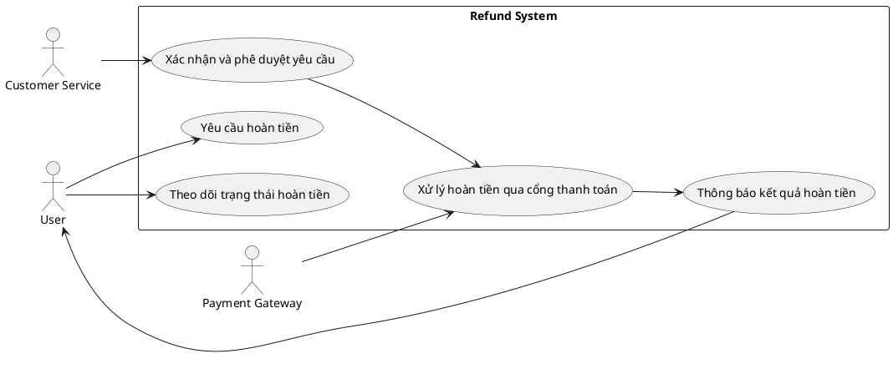
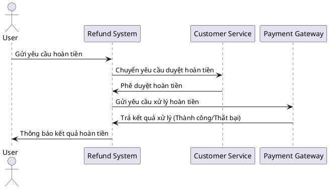
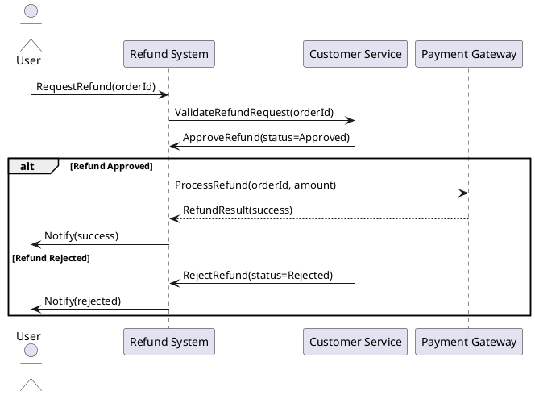
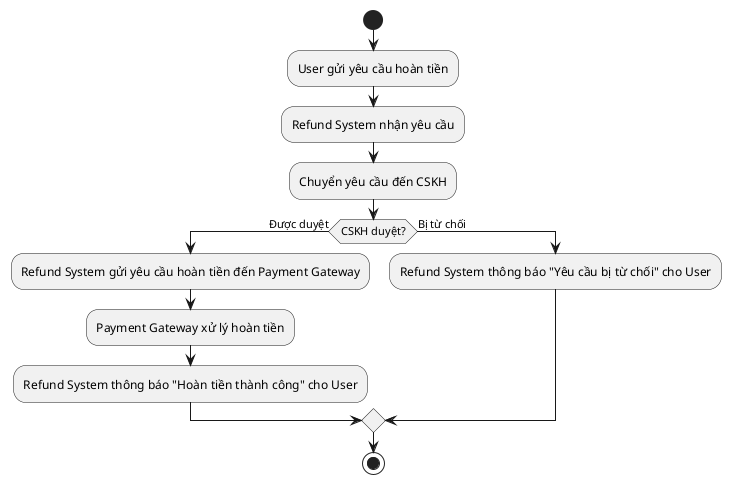
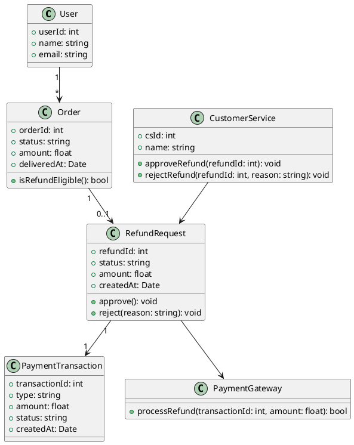
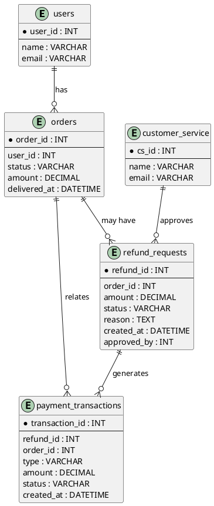
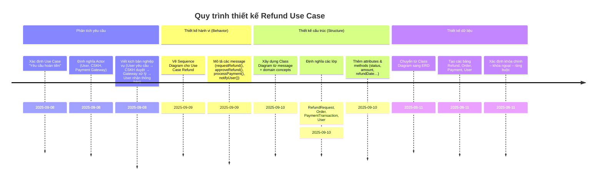

Câu hỏi này rất sát với thực tế trong **Thiết kế Hệ thống TMĐT** 👍.
Mình sẽ triển khai theo hướng **phân tích yêu cầu → thiết kế → Use Case**.

---

## 1. Phân tích yêu cầu người dùng

Yêu cầu:

> "Với vai trò người dùng, tôi muốn hoàn tiền sản phẩm dễ hơn."

Ý nghĩa:

* Người dùng mong muốn có một **quy trình trả hàng/hoàn tiền** nhanh gọn, ít thao tác, minh bạch.
* Thay vì phải gọi hotline hoặc gửi email, người dùng muốn **thao tác trực tuyến** ngay trên hệ thống.

---

## 2. Thiết kế hệ thống (mức khái niệm)

### Thành phần liên quan

* **Người dùng (Customer)**: Yêu cầu hoàn tiền cho đơn hàng.
* **Hệ thống TMĐT**: Ghi nhận yêu cầu, kiểm tra điều kiện (trong thời gian cho phép, trạng thái đơn hàng).
* **Nhân viên CSKH (Admin/Support)**: Xác nhận yêu cầu hoàn tiền.
* **Cổng thanh toán/Ngân hàng**: Thực hiện hoàn tiền cho người dùng.

### Luồng hoạt động

1. Người dùng chọn **Đơn hàng → Yêu cầu hoàn tiền**.
2. Hệ thống kiểm tra: đơn hàng đã giao, còn trong thời gian trả hàng, sản phẩm đủ điều kiện.
3. Người dùng upload lý do + minh chứng (ảnh, video).
4. Hệ thống tạo **Phiếu hoàn tiền** và gửi đến CSKH.
5. CSKH duyệt yêu cầu.
6. Hệ thống gửi lệnh hoàn tiền đến cổng thanh toán.
7. Người dùng nhận thông báo hoàn tiền thành công.

---

## 3. Use Case: “Hoàn tiền sản phẩm”

### Tên Use Case

Hoàn tiền sản phẩm

### Actor chính

* Customer (Người dùng)
* Support Staff (CSKH/Admin)
* Payment Gateway

### Mô tả ngắn gọn

Người dùng có thể gửi yêu cầu hoàn tiền trực tuyến cho sản phẩm đã mua, hệ thống sẽ xử lý và thực hiện hoàn tiền qua cổng thanh toán.

### Luồng chính (Main Flow)

1. Customer đăng nhập hệ thống.
2. Customer mở chi tiết đơn hàng → chọn “Yêu cầu hoàn tiền”.
3. Hệ thống hiển thị form nhập lý do + upload minh chứng.
4. Customer gửi yêu cầu.
5. Hệ thống kiểm tra điều kiện hoàn tiền.
6. Hệ thống tạo “Phiếu hoàn tiền” → gửi đến CSKH.
7. CSKH duyệt.
8. Hệ thống gọi API Payment Gateway → thực hiện hoàn tiền.
9. Hệ thống gửi thông báo cho Customer.

### Luồng thay thế (Alternative Flow)

* Nếu đơn hàng **không đủ điều kiện hoàn tiền** → hệ thống hiển thị thông báo từ chối, không gửi phiếu.
* Nếu Payment Gateway từ chối hoàn tiền → hệ thống thông báo lỗi và gợi ý liên hệ CSKH.

### Tiền điều kiện (Pre-condition)

* Customer đã mua hàng và có đơn hàng hoàn thành.
* Đơn hàng còn trong thời gian quy định cho phép hoàn tiền.

### Hậu điều kiện (Post-condition)

* Tiền được hoàn về tài khoản của Customer.
* Đơn hàng có trạng thái cập nhật thành “Đã hoàn tiền”.

---

👉 Như vậy, từ một **User Story** ("Tôi muốn hoàn tiền sản phẩm dễ hơn"), ta triển khai thành **Use Case Hoàn tiền sản phẩm**, có thể minh họa bằng **Use Case Diagram**:

* Actor: Customer, CSKH, Payment Gateway.
* Use Case: Hoàn tiền sản phẩm.

---

Bạn có muốn mình vẽ luôn **Use Case Diagram (PlantUML)** cho kịch bản này để minh họa trực quan không?


Ok 👍. Dựa trên yêu cầu *“Với vai trò người dùng, tôi muốn hoàn tiền sản phẩm dễ hơn”*, mình sẽ thiết kế **Use Case Diagram** mô tả các tác nhân (User, Admin/CSKH, Payment Gateway) và các chức năng liên quan.

### Các tác nhân (Actors):

* **User (Khách hàng)**: Yêu cầu hoàn tiền.
* **Customer Service (CSKH/Admin)**: Xác nhận yêu cầu, duyệt hoàn tiền.
* **Payment Gateway**: Xử lý giao dịch hoàn tiền.

### Các Use cases chính:

1. **Yêu cầu hoàn tiền** (User)
2. **Theo dõi trạng thái hoàn tiền** (User)
3. **Xác nhận và phê duyệt yêu cầu** (CSKH/Admin)
4. **Xử lý hoàn tiền qua cổng thanh toán** (Payment Gateway)
5. **Thông báo kết quả hoàn tiền** (System gửi tới User)

---

### PlantUML cho Use Case Diagram:



---

Bạn có muốn mình vẽ thêm **Sequence Diagram** cho luồng *User yêu cầu hoàn tiền → CSKH duyệt → Payment Gateway xử lý → Thông báo cho User* không?


Ok 👍. Mình sẽ vẽ **Sequence Diagram** cho luồng:

**User yêu cầu hoàn tiền → CSKH duyệt → Payment Gateway xử lý → Hệ thống thông báo cho User**.

---

### Các thành phần (Lifelines):

* **User** (Khách hàng)
* **Refund System** (Hệ thống TMĐT xử lý yêu cầu)
* **Customer Service** (Nhân viên CSKH/Admin)
* **Payment Gateway** (Cổng thanh toán)

---

### PlantUML Sequence Diagram



---

👉 Biểu đồ này thể hiện quy trình từ khi **User gửi yêu cầu** cho đến khi **nhận được thông báo hoàn tiền** sau khi hệ thống + CSKH + Payment Gateway xử lý xong.

Bạn có muốn mình mở rộng thêm **trường hợp yêu cầu bị từ chối** (ví dụ: quá thời hạn, sai lý do, không hợp lệ) trong Sequence Diagram này không?


Bạn nhận xét rất đúng 👌.

Thực tế:

* **Activity Diagram**: thường mô tả *luồng công việc* (workflow) → nhìn giống các bước tuần tự từ A → B → C.
* **Sequence Diagram**: tập trung vào *tương tác giữa các đối tượng (lifelines)* theo **trục thời gian dọc**. Nó không phải chỉ liệt kê các bước tuần tự, mà phải nhấn mạnh:

  * Ai gọi ai (User → Refund System).
  * Tin nhắn/truyền thông nào đi qua.
  * Thứ tự thời gian từ trên xuống dưới.
  * Có thể thêm *alt/opt* để thể hiện nhánh điều kiện.

👉 Vậy code PlantUML mình đưa bạn ở trên **đúng là Sequence Diagram**, nhưng vì luồng đơn giản nên nó trông hơi giống Activity.

Ví dụ cải tiến để nhìn rõ hơn "chất Sequence":



✨ Điểm khác biệt:

* Có **messages với tham số** (RequestRefund(orderId), ProcessRefund(...)).
* Có **alt/else** thể hiện nhánh xử lý (Approved vs Rejected).
* Các actor/lifelines rõ ràng → đúng chất *Sequence Diagram*.

---

👉 Bạn có muốn mình vẽ thêm một bản **Activity Diagram** song song với Sequence Diagram này để bạn so sánh trực quan sự khác biệt không?


Rất hay 👍. Mình sẽ làm song song cả **Sequence Diagram** và **Activity Diagram** cho cùng một tình huống *“User yêu cầu hoàn tiền”* để bạn thấy rõ sự khác biệt.

---

## 1. Sequence Diagram (tập trung vào *ai* giao tiếp với *ai*)


---

## 2. Activity Diagram (tập trung vào *luồng công việc*)



---

### 🔑 So sánh

* **Sequence Diagram**: nhấn mạnh *đối tượng tham gia* (User, Refund System, CSKH, Payment Gateway) và *message* trao đổi → phù hợp cho **thiết kế hệ thống, API, giao tiếp giữa các module**.
* **Activity Diagram**: nhấn mạnh *luồng công việc* và *điều kiện nhánh* → phù hợp cho **mô tả quy trình nghiệp vụ** từ góc nhìn tổng thể.

---

👉 Bạn có muốn mình thêm **Use Case Diagram** để tạo bộ “3 trong 1” (Use Case + Sequence + Activity) cho kịch bản hoàn tiền này không?


Câu hỏi này rất thực tế 👌.

Nếu mục tiêu là **bắt đầu code** thì chỉ vẽ Sequence Diagram **thường chưa đủ**, vì:

* **Sequence Diagram** giúp bạn thấy **luồng tương tác giữa các thành phần/đối tượng**, nhưng không nói chi tiết về **cấu trúc dữ liệu** hay **API**.
* Lập trình viên khi code cần biết:

  1. **Use Case Diagram** → để hiểu phạm vi & ai dùng chức năng gì.
  2. **Sequence Diagram** → để hiểu flow nghiệp vụ giữa các thành phần.
  3. **Class Diagram / ERD** → để thiết kế **database và logic nghiệp vụ**.
  4. **API Design (REST/GraphQL)** → để biết endpoint, input/output cụ thể.

---

### Ví dụ với chức năng **Hoàn tiền**:

* **Use Case**: “Người dùng yêu cầu hoàn tiền” (actor: User, CSKH).
* **Sequence Diagram**: mô tả các bước User → Refund System → CSKH → Payment Gateway.
* **Class Diagram**: có lớp `Order`, `RefundRequest`, `PaymentTransaction`, với quan hệ và thuộc tính.
* **ERD**: bảng `orders`, `refunds`, `payment_transactions`.
* **API**:

  * `POST /api/refunds` → gửi yêu cầu hoàn tiền.
  * `PUT /api/refunds/{id}/approve` → CSKH duyệt.
  * `GET /api/refunds/{id}` → lấy trạng thái hoàn tiền.

---

👉 Nếu chỉ muốn **làm prototype nhỏ** → Sequence Diagram + API spec có thể tạm đủ.
👉 Nếu làm **hệ thống lớn, nhiều người code chung** → nên có đầy đủ bộ (Use Case + Sequence + Class/ERD + API).

---

Bạn muốn mình minh họa luôn **Class Diagram + ERD + API cho chức năng Hoàn tiền** để thấy sự liên kết từ phân tích → đến code không?


Hay 👍, mình giải thích rõ **logic nghiệp vụ (business logic)** nhé.

---

### 1. Logic nghiệp vụ là gì?

* Là **tập hợp các quy tắc và xử lý** mô tả *hệ thống phải hoạt động thế nào* để đáp ứng **nghiệp vụ thực tế**.
* Không phải giao diện (UI) hay lưu trữ (DB), mà là **các điều kiện, ràng buộc, quy tắc xử lý dữ liệu**.
* Thường được viết trong **Service Layer** hoặc **Domain Layer** của hệ thống.

---

### 2. Ví dụ: Chức năng **Hoàn tiền đơn hàng** trong TMĐT

#### Luồng logic nghiệp vụ

1. Người dùng gửi yêu cầu hoàn tiền.
2. Hệ thống kiểm tra điều kiện:

   * Đơn hàng đã giao chưa?
   * Yêu cầu còn trong thời hạn hoàn tiền (ví dụ: 7 ngày)?
   * Sản phẩm có nằm trong danh mục cho phép hoàn tiền không?
   * Số tiền hoàn <= số tiền đã thanh toán.
3. Nếu **hợp lệ** → tạo record `RefundRequest` với trạng thái `"Pending"`.
4. CSKH xem xét và **duyệt / từ chối**.
5. Nếu duyệt → gọi Payment Gateway để chuyển tiền về tài khoản của User.
6. Hệ thống cập nhật trạng thái Refund và gửi thông báo cho User.

---

#### Một đoạn **pseudocode (giả mã)** cho logic nghiệp vụ:

```python
def request_refund(order_id, user_id):
    order = Order.get(order_id)
    
    if not order:
        raise Exception("Đơn hàng không tồn tại")
    
    if order.user_id != user_id:
        raise Exception("Không thể hoàn tiền cho đơn của người khác")
    
    if order.status != "DELIVERED":
        raise Exception("Chỉ hoàn tiền cho đơn đã giao thành công")
    
    if days_between(order.delivered_at, today()) > 7:
        raise Exception("Đã quá hạn hoàn tiền (7 ngày)")
    
    refund = RefundRequest(
        order_id=order_id,
        user_id=user_id,
        amount=order.amount,
        status="PENDING"
    )
    refund.save()
    return refund
```

---

### 3. Tóm lại

* **Logic nghiệp vụ** là cái “luật chơi” → kiểm soát hệ thống hoạt động đúng nghiệp vụ (business).
* Nó nằm ở giữa UI và DB.
* Ví dụ trong hoàn tiền: kiểm tra hạn mức, trạng thái đơn hàng, gọi Payment Gateway, cập nhật trạng thái.

---

👉 Bạn có muốn mình viết thêm **Class Diagram cho Refund** để mô hình hóa luôn phần business logic này không?


Ok 👍, mình sẽ mô hình hóa **Class Diagram cho Refund** để minh họa rõ phần **business logic** trong hệ thống TMĐT.

---

## 🎯 Các lớp liên quan đến Refund

* **User**: Người dùng yêu cầu hoàn tiền.
* **Order**: Đơn hàng gốc mà User đã mua.
* **RefundRequest**: Yêu cầu hoàn tiền (trạng thái: Pending, Approved, Rejected, Completed).
* **PaymentTransaction**: Giao dịch thanh toán (bao gồm hoàn tiền).
* **CustomerService**: Nhân viên duyệt yêu cầu hoàn tiền.
* **PaymentGateway**: Cổng thanh toán bên thứ 3.

---

## 📌 PlantUML Class Diagram



---

## 🔑 Ý nghĩa

* Một **User** có thể có nhiều **Order**.
* Một **Order** có thể liên kết với **một RefundRequest** (nếu phát sinh hoàn tiền).
* **RefundRequest** tạo ra **PaymentTransaction** kiểu `"REFUND"`.
* **CustomerService** quyết định approve/reject.
* **PaymentGateway** xử lý refund và trả kết quả.

---

👉 Bạn có muốn mình viết tiếp **ERD (các bảng CSDL)** tương ứng với Class Diagram này để dễ triển khai code không?


Tốt 👍. Giờ mình sẽ chuyển từ **Class Diagram** sang **ERD (Entity Relationship Diagram)** để thiết kế CSDL cho chức năng **Refund**.

---

## 📌 Các bảng chính trong ERD

1. **users**

   * Lưu thông tin người dùng.

2. **orders**

   * Lưu thông tin đơn hàng.

3. **refund\_requests**

   * Lưu yêu cầu hoàn tiền.

4. **payment\_transactions**

   * Lưu các giao dịch thanh toán (bao gồm cả refund).

5. **customer\_service**

   * Lưu thông tin nhân viên CSKH xử lý refund.

---

## 🗄️ Cấu trúc bảng (gợi ý)

```sql
-- Bảng người dùng
CREATE TABLE users (
    user_id INT PRIMARY KEY AUTO_INCREMENT,
    name VARCHAR(100),
    email VARCHAR(100) UNIQUE
);

-- Bảng đơn hàng
CREATE TABLE orders (
    order_id INT PRIMARY KEY AUTO_INCREMENT,
    user_id INT,
    status VARCHAR(50), -- e.g. PENDING, DELIVERED, CANCELLED
    amount DECIMAL(10,2),
    delivered_at DATETIME,
    FOREIGN KEY (user_id) REFERENCES users(user_id)
);

-- Bảng yêu cầu hoàn tiền
CREATE TABLE refund_requests (
    refund_id INT PRIMARY KEY AUTO_INCREMENT,
    order_id INT,
    amount DECIMAL(10,2),
    status VARCHAR(50), -- e.g. PENDING, APPROVED, REJECTED, COMPLETED
    reason TEXT,
    created_at DATETIME DEFAULT CURRENT_TIMESTAMP,
    approved_by INT NULL, -- CSKH duyệt
    FOREIGN KEY (order_id) REFERENCES orders(order_id),
    FOREIGN KEY (approved_by) REFERENCES customer_service(cs_id)
);

-- Bảng giao dịch thanh toán
CREATE TABLE payment_transactions (
    transaction_id INT PRIMARY KEY AUTO_INCREMENT,
    refund_id INT NULL,
    order_id INT,
    type VARCHAR(50), -- e.g. PAYMENT, REFUND
    amount DECIMAL(10,2),
    status VARCHAR(50), -- e.g. SUCCESS, FAILED
    created_at DATETIME DEFAULT CURRENT_TIMESTAMP,
    FOREIGN KEY (refund_id) REFERENCES refund_requests(refund_id),
    FOREIGN KEY (order_id) REFERENCES orders(order_id)
);

-- Bảng nhân viên CSKH
CREATE TABLE customer_service (
    cs_id INT PRIMARY KEY AUTO_INCREMENT,
    name VARCHAR(100),
    email VARCHAR(100)
);
```

---

## 📌 ERD bằng PlantUML



---

✅ Bây giờ bạn đã có:

* **Class Diagram** (logic nghiệp vụ).
* **ERD** (thiết kế CSDL).

👉 Bạn có muốn mình viết tiếp **thiết kế REST API cho Refund** (endpoint + input/output JSON) để khớp từ ERD → code không?


Câu hỏi rất chuẩn 👌. Đây chính là **kỹ năng phân tích yêu cầu & mô hình hóa** trong thiết kế hệ thống.
Mình sẽ giải thích cách **xác định các trường dữ liệu (attributes/columns)** trong **Class Diagram** và **ERD**, dựa trên **các loại diagram và thành phần**.

---

## 🔑 1. Nguồn thông tin để lấy dữ liệu

Khi thiết kế, kỹ sư thường dựa vào:

1. **Use Case Diagram + Use Case Description**

   * Cho biết **chức năng hệ thống** và **ai làm gì**.
   * Từ đó suy ra dữ liệu nào cần để thực hiện use case.

2. **Sequence Diagram (hoặc Activity Diagram)**

   * Cho thấy **luồng thông điệp (message)** giữa các đối tượng.
   * Các tham số truyền đi thường chính là dữ liệu cần lưu (ví dụ: `orderId`, `amount`, `status`).

3. **Business Logic / Quy tắc nghiệp vụ**

   * Quy định điều kiện xử lý → đòi hỏi thêm trường dữ liệu.
   * Ví dụ: “hoàn tiền trong vòng 7 ngày” → cần trường `delivered_at` trong `orders`.

4. **Class Diagram**

   * Mô tả đối tượng trong domain → mỗi class có **thuộc tính (attributes)** → chuyển thành **cột trong bảng ERD**.

---

## 🔎 2. Ví dụ: Refund

### (a) Use Case: *Người dùng yêu cầu hoàn tiền*

* Input: `orderId`, `reason`.
* Output: `status` (Pending, Approved...).

👉 Suy ra `refund_requests` cần có `refund_id`, `order_id`, `reason`, `status`.

---

### (b) Sequence Diagram

```
User -> Refund System: RequestRefund(orderId)
Refund System -> CS: ValidateRefund(orderId)
CS -> Refund System: ApproveRefund(status)
Refund System -> PG: ProcessRefund(orderId, amount)
```

👉 Ta thấy cần các dữ liệu: `orderId`, `status`, `amount`.

---

### (c) Business Rules

* “Chỉ hoàn tiền trong vòng 7 ngày kể từ khi giao hàng.”
  👉 Ta cần lưu `delivered_at` trong bảng `orders`.

* “CSKH có thể từ chối với lý do.”
  👉 Ta cần trường `reason` trong `refund_requests`.

---

### (d) Class Diagram → ERD

* Class `RefundRequest` có: `refundId`, `status`, `amount`, `createdAt`.
* Class `Order` có: `orderId`, `status`, `amount`, `deliveredAt`.
* Mapping qua ERD: mỗi **attribute** → **column**.

---

## 📌 Tóm lại quy trình suy luận

1. **Xác định chức năng (Use Case)** → biết cần quản lý dữ liệu nào.
2. **Xem Sequence Diagram** → lấy các tham số trong message làm gợi ý cho thuộc tính.
3. **Xem Business Rules** → thêm các trường dữ liệu phục vụ ràng buộc nghiệp vụ.
4. **Class Diagram** → chuyển attributes thành bảng & cột trong ERD.

---

👉 Nói cách khác:

* **Use Case** cho bạn biết *cái gì cần lưu*.
* **Sequence Diagram** cho bạn biết *cần truyền dữ liệu gì giữa các thành phần*.
* **Business Rules** cho bạn biết *trường nào cần để kiểm tra logic*.
* **Class/ERD** là kết quả cuối cùng của việc gom và chuẩn hóa dữ liệu từ 3 nguồn trên.

---

Bạn có muốn mình làm một **bảng mapping minh họa** (Use Case → Message trong Sequence → Attribute trong Class → Column trong ERD) cho ví dụ Refund này không?


Rồi 👍. Mình sẽ lập **bảng mapping minh họa** cho ví dụ **Refund** để bạn thấy rõ cách dữ liệu được “dẫn dắt” từ yêu cầu nghiệp vụ → đến thiết kế CSDL.

---

## 📌 Bảng Mapping dữ liệu cho chức năng **Refund**

| Use Case (Yêu cầu)                                | Message trong Sequence Diagram                   | Attribute trong Class Diagram                  | Column trong ERD (`SQL table`)                     |
| ------------------------------------------------- | ------------------------------------------------ | ---------------------------------------------- | -------------------------------------------------- |
| User gửi yêu cầu hoàn tiền cho đơn hàng           | `RequestRefund(orderId, reason)`                 | `RefundRequest.refundId`, `orderId`, `reason`  | `refund_requests.refund_id`, `order_id`, `reason`  |
| CSKH duyệt yêu cầu hoàn tiền                      | `ApproveRefund(status)` / `RejectRefund(reason)` | `RefundRequest.status`, `RefundRequest.reason` | `refund_requests.status`, `refund_requests.reason` |
| Refund System kiểm tra số tiền đơn hàng           | `ProcessRefund(orderId, amount)`                 | `Order.amount`, `RefundRequest.amount`         | `orders.amount`, `refund_requests.amount`          |
| Kiểm tra thời gian giao hàng để xét hạn hoàn tiền | (Điều kiện nghiệp vụ, không truyền trực tiếp)    | `Order.deliveredAt`                            | `orders.delivered_at`                              |
| Lưu trạng thái giao dịch hoàn tiền với PG         | `RefundResult(success/fail)`                     | `PaymentTransaction.status`                    | `payment_transactions.status`                      |
| Lưu chi tiết giao dịch thanh toán                 | `ProcessRefund(orderId, amount)`                 | `PaymentTransaction.transactionId`, `amount`   | `payment_transactions.transaction_id`, `amount`    |
| CSKH chịu trách nhiệm phê duyệt                   | (Không phải message, nhưng actor tham gia)       | `CustomerService.csId`, `name`                 | `customer_service.cs_id`, `name`                   |
| Ghi nhận thời điểm tạo yêu cầu                    | (Tự sinh trong hệ thống khi lưu)                 | `RefundRequest.createdAt`                      | `refund_requests.created_at`                       |

---

## 🔑 Nhận xét

* **Use Case** → chỉ nói “người dùng muốn gì” (vd: hoàn tiền).
* **Sequence Diagram** → cho biết **cần trao đổi dữ liệu gì** để thực hiện yêu cầu.
* **Class Diagram** → gom dữ liệu thành **thuộc tính đối tượng** (Order, RefundRequest, PaymentTransaction...).
* **ERD** → cuối cùng chuyển thành **cột trong bảng CSDL**.

---

👉 Bảng này giúp bạn **traceability** (truy vết) từ nghiệp vụ → thiết kế → database.
Nếu thầy/cô hỏi “tại sao có cột `delivered_at` trong bảng orders?” → bạn trả lời: **để phục vụ business rule hoàn tiền trong 7 ngày**.

---

Bạn có muốn mình làm thêm một **sơ đồ trace (chuỗi liên kết)** trực quan từ Use Case → Sequence → Class → ERD để dễ trình bày trong báo cáo không?


Câu hỏi rất hay 👍. Khi thiết kế **thuộc tính (attributes) trong Class Diagram**, bạn cần dựa trên nhiều nguồn thông tin khác nhau để đảm bảo đầy đủ và đúng mục đích. Mình sẽ giải thích theo quy trình chuẩn trong phân tích & thiết kế hệ thống:

---

## 🔹 1. Xuất phát từ **Use Case**

* **Use Case** mô tả chức năng người dùng cần (ví dụ: *Refund Order*).
* Từ các **dòng mô tả luồng chính & luồng thay thế**, ta thấy được:

  * Các thông tin cần nhập từ người dùng (input).
  * Các thông tin cần hiển thị lại (output).
  * Các điều kiện kiểm tra (validation).

👉 Đây chính là những ứng viên ban đầu để trở thành **thuộc tính trong Class**.

---

## 🔹 2. Xem **Sequence Diagram**

* **Messages** trong Sequence cho thấy:

  * Hệ thống gọi đến các đối tượng nào.
  * Tham số truyền đi là gì.
    👉 Những tham số này gợi ý **dữ liệu cần lưu tạm hoặc lâu dài**, từ đó thành thuộc tính của Class.

---

## 🔹 3. Xem xét **Domain Model / Business Concepts**

* Nếu bạn có **Domain Model** (biểu đồ khái niệm nghiệp vụ), hãy lấy các **noun (danh từ)** trong mô tả nghiệp vụ:

  * *Refund, Order, Payment, Customer, Staff…*
    👉 Mỗi danh từ trở thành **Class**, còn đặc điểm mô tả nó trở thành **Attribute**.

---

## 🔹 4. Xác định thuộc tính qua **các loại thông tin cần quản lý**

Ví dụ với **Refund**:

* **Thông tin định danh**: `refund_id` (khóa chính).
* **Thông tin liên kết**: `order_id`, `payment_id`, `customer_id`.
* **Thông tin nghiệp vụ**: `refund_amount`, `reason`, `status`.
* **Thông tin thời gian**: `created_at`, `processed_at`.
* **Thông tin tác nhân**: `processed_by (staff_id)`.

---

## 🔹 5. Mapping sang ERD

* Mỗi **thuộc tính trong Class** → trở thành **column trong bảng** tương ứng trong ERD.
* Khóa chính, khóa ngoại được xác định dựa vào **mối quan hệ giữa các Class** (association, aggregation, composition).

---

## 🔹 6. Checklist khi chọn thuộc tính

✅ Có cần thiết cho Use Case không?
✅ Có lưu trữ lâu dài không?
✅ Có tham gia vào quan hệ giữa các Class không?
✅ Có phải thông tin tính toán được (nếu có thể tính toán → không nên lưu trực tiếp)?

---

👉 Tóm lại:

* **Use Case** → cho biết dữ liệu người dùng cần nhập/xuất.
* **Sequence** → cho biết dữ liệu hệ thống trao đổi.
* **Domain Model** → cho biết đặc điểm bản chất của đối tượng.
* **Class Diagram** → gom nhóm và gắn kết thành thuộc tính.
* **ERD** → chuyển thành bảng và cột.

---

Bạn có muốn mình làm **bảng minh họa quy trình xác định thuộc tính Refund** (từ Use Case → Sequence → Class → ERD) giống như một "traceability table" không?


Câu hỏi này thuộc về **thứ tự thiết kế UML** – khá nhiều bạn cũng thắc mắc giống bạn 👍.
Mình giải thích theo 2 góc nhìn: **chuẩn lý thuyết UML** và **thực tế triển khai hệ thống**.

---

## 🔹 1. Trong lý thuyết UML (quy trình thác nước / RUP truyền thống)

1. **Use Case Diagram**: xác định chức năng hệ thống.
2. **Class Diagram (Domain Model ban đầu)**: phác họa các khái niệm nghiệp vụ (Order, Refund, Customer…).
3. **Sequence Diagram**: mô tả luồng tương tác của các đối tượng trong một Use Case cụ thể.
4. **Cập nhật lại Class Diagram**: sau khi có Sequence, bạn bổ sung thêm phương thức, quan hệ, thuộc tính.

👉 Tức là: **Class vẽ trước → Sequence vẽ sau → rồi quay lại refine Class**.

---

## 🔹 2. Trong thực tế (Agile / Iterative)

* Thường **Sequence** hoặc **Activity** được phác thảo trước từ Use Case để hiểu rõ logic.
* Sau đó mới rút ra các **Class** từ các message, tham số, actor liên quan.
* Rồi quay lại chỉnh sửa Sequence nếu thấy thiếu class/thuộc tính.

👉 Tức là: **Sequence và Class có thể làm song song**, nhưng thường **Sequence được thử trước cho từng Use Case**, rồi mới consolidate thành Class Diagram chuẩn.

---

## 🔹 3. Kết luận

* Nếu đi **theo sách vở** → Vẽ **Class Diagram khái niệm** trước, rồi Sequence, rồi refine Class.
* Nếu đi **theo thực tế triển khai** → Có thể phác **Sequence sơ bộ trước**, sau đó mới hoàn thiện Class Diagram.

📌 Nguyên tắc:

* **Class Diagram** = cái nhìn **tĩnh (static)** → dữ liệu và cấu trúc hệ thống.
* **Sequence Diagram** = cái nhìn **động (dynamic)** → hành vi, luồng xử lý.

👉 Hai cái này **bổ sung qua lại**. Không phải cái nào tuyệt đối trước sau, mà là **iterative (lặp đi lặp lại)**.

---

Bạn có muốn mình vẽ timeline **chuẩn quy trình thiết kế Refund Use Case** (Use Case → Sequence → Class → ERD) để dễ hình dung hơn không?


Ok 👌 mình sẽ vẽ **timeline chuẩn cho Refund Use Case** theo quy trình thiết kế hệ thống.

---

# 📝 Timeline thiết kế Use Case "Refund"



---

## 📌 Giải thích từng bước

1. **Use Case** → định nghĩa yêu cầu nghiệp vụ, ai tham gia.
2. **Sequence Diagram** → làm rõ luồng xử lý theo thời gian.
3. **Class Diagram** → trích xuất từ các message + khái niệm nghiệp vụ thành class, method, attribute.
4. **ERD** → chuyển đổi từ Class Diagram sang mô hình dữ liệu quan hệ (database).

👉 Đây chính là **dòng chảy chuẩn** từ yêu cầu người dùng → hành vi → cấu trúc → dữ liệu.

---

Bạn có muốn mình **minh họa luôn bằng sơ đồ cụ thể cho Refund Use Case** (Use Case, Sequence, Class, ERD) theo timeline này không?


Câu hỏi hay 👍. Trong quy trình phát triển phần mềm (ví dụ theo **SDLC hoặc Agile**), các vai trò thường phân chia như sau:

---

## 🧑‍💼 **BA (Business Analyst) – Phân tích nghiệp vụ**

* **Nhiệm vụ chính:** Hiểu yêu cầu của khách hàng & chuyển thành đặc tả hệ thống.
* **Kết quả (Artifacts):**

  * Tài liệu yêu cầu (SRS, BRD).
  * **Use Case Diagram** & mô tả kịch bản.
  * User Story (nếu Agile).
  * Quy tắc nghiệp vụ (Business Rules).
  * Đặc tả luồng nghiệp vụ (Business Process / Activity Diagram).
* 👉 BA **không đi sâu vào code**, mà làm rõ *cần làm gì* và *tại sao cần làm*.

---

## 👨‍💻 **System Analyst / Software Engineer (Designer / Architect)**

* **Nhiệm vụ chính:** Thiết kế giải pháp kỹ thuật từ yêu cầu BA.
* **Kết quả (Artifacts):**

  * **Sequence Diagram** (mô tả interaction).
  * **Class Diagram** (mô hình đối tượng & logic nghiệp vụ).
  * **ERD** (cơ sở dữ liệu).
  * Thiết kế API (REST/GraphQL).
  * Kiến trúc hệ thống (component diagram, deployment diagram).
* 👉 Engineer tập trung vào *thiết kế chi tiết hệ thống* để coder có thể triển khai.

---

## 👩‍💻 **Coder / Developer**

* **Nhiệm vụ chính:** Hiện thực hóa thiết kế thành phần mềm chạy được.
* **Kết quả (Artifacts):**

  * Code back-end (Java, .NET, Node.js, Python…).
  * Code front-end (React, Angular, Flutter…).
  * Database schema (SQL migration, ORM model).
  * Unit Test, Integration Test.
* 👉 Developer tập trung vào *làm thế nào* để chạy được & đúng theo thiết kế.

---

## 🔄 Ví dụ cho **Refund Use Case**

* **BA**: Viết yêu cầu "Người dùng muốn hoàn tiền dễ dàng hơn", vẽ Use Case Diagram.
* **Engineer**: Vẽ Sequence Diagram (User → Refund System → Payment Gateway), tạo Class Diagram (RefundRequest, Payment, User), ERD (Refund table, Payment table).
* **Coder**:

  * Viết API `POST /refunds` để tạo refund request.
  * Viết logic duyệt refund.
  * Tích hợp Payment Gateway (PayPal/VNPAY).
  * Cập nhật DB, gửi notification cho user.

---

👉 Tóm lại:

* **BA = Cái gì? (What, Why)**
* **Engineer = Thiết kế ra sao? (How – at design level)**
* **Coder = Cách code chi tiết? (How – at implementation level)**

---

Bạn có muốn mình làm **bảng phân công nhiệm vụ BA – Engineer – Coder cho toàn bộ quy trình Refund Use Case** để nhìn trực quan không?


