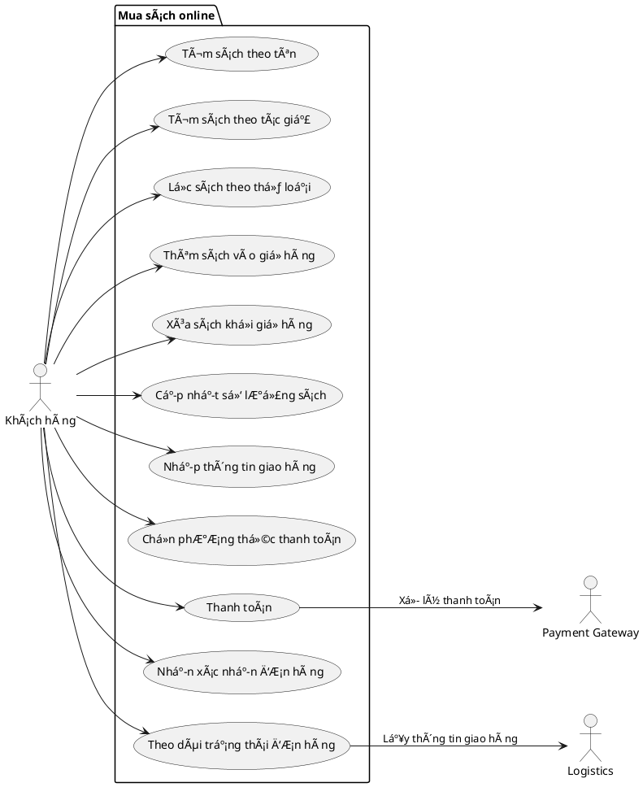
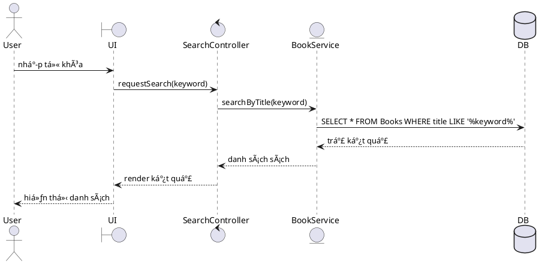
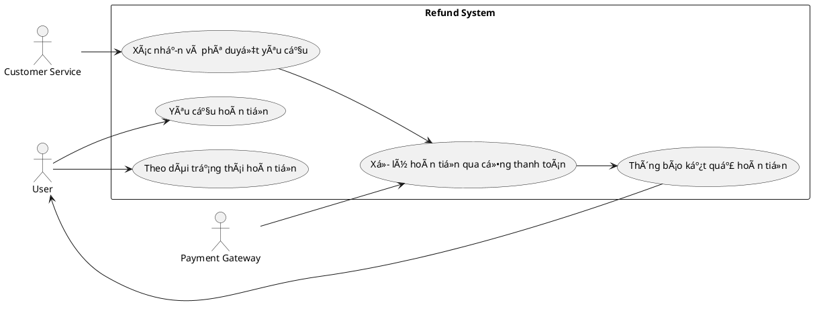
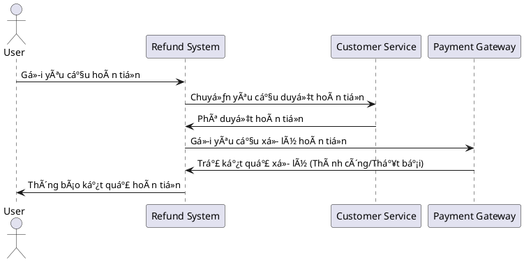
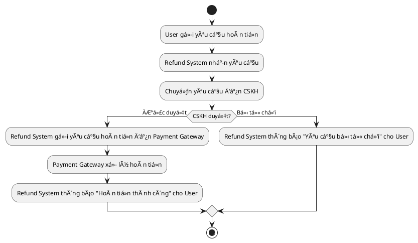
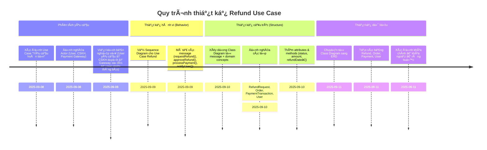

# 1. Business Requirements

Business requirement là **những yêu cầu cấp cao phản ánh mục tiêu, lợi ích, và nhu cầu kinh doanh** (không phải chi tiết chức năng cụ thể). Nó trả lá»i câu há»i: *Doanh nghiệp muốn đạt được gì khi xây dá»±ng hệ thống?*

Ví dụ trong **hệ thống TMÄT (E-commerce)**:

---

### 📌 Ví dụ Business Requirements

1. **Tăng doanh thu trực tuyến**

   * Doanh nghiệp muốn hệ thống TMÄT giúp mở rá»™ng thị trÆ°á»ng và tăng doanh thu bán hàng trá»±c tuyến ít nhất 30% trong 12 tháng tá»›i.

2. **Cải thiện trải nghiệm khách hàng**

   * Cần có ná»n tảng bán hàng online giúp khách hàng dá»… dàng tìm kiếm, đặt hàng và thanh toán trong vòng < 3 phút.

3. **Hỗ trợ đa kênh (Omni-channel)**

   * Hệ thống cần đồng bộ tồn kho giữa website, ứng dụng di động và cửa hàng offline.

4. **Giảm chi phí vận hành**

   * Tự động hóa xử lý đơn hàng, thanh toán và kết nối logistics để giảm 20% chi phí vận hành.

5. **Mở rá»™ng thị trÆ°á»ng quốc tế**

   * Há»— trợ Ä‘a ngôn ngữ (tiếng Việt, tiếng Anh) và nhiá»u loại tiá»n tệ để phục vụ khách hàng ở Äông Nam Ã.

---

👉 Business Requirement là **mục tiêu lớn của doanh nghiệp**, từ đó BA (Business Analyst) sẽ phân rã thành **Functional Requirements** (chức năng cụ thể) và **Non-functional Requirements** (hiệu năng, bảo mật…).

---------------------------------------------
# 2. Functional Requirements

Functional Requirements (Yêu cầu chức năng) là **những gì hệ thống cần làm**, mô tả hành vi, chức năng hoặc dịch vụ mà hệ thống phải cung cấp để đáp ứng Business Requirements.

Ví dụ trong một hệ thống **Website Bán Hàng Online**:

---

### Functional Requirements (Ví dụ)

1. **Quản lý tài khoản ngÆ°á»i dùng**

   * Hệ thống cho phép khách hàng đăng ký tài khoản mới bằng email hoặc số điện thoại.
   * Hệ thống cho phép ngÆ°á»i dùng đăng nhập bằng email/số Ä‘iện thoại và mật khẩu.
   * Hệ thống cho phép ngÆ°á»i dùng đặt lại mật khẩu qua email xác thá»±c.

2. **Chức năng tìm kiếm và duyệt sản phẩm**

   * NgÆ°á»i dùng có thể tìm kiếm sản phẩm theo tên, loại, hoặc khoảng giá.
   * Hệ thống hiển thị danh sách sản phẩm theo bá»™ lá»c (giá, thÆ°Æ¡ng hiệu, Ä‘á»™ phổ biến).
   * Hệ thống cho phép ngÆ°á»i dùng sắp xếp kết quả tìm kiếm theo giá tăng/giảm dần.

3. **Chức năng giỠhàng**

   * NgÆ°á»i dùng có thể thêm sản phẩm vào giá» hàng.
   * NgÆ°á»i dùng có thể cập nhật số lượng hoặc xóa sản phẩm trong giá» hàng.
   * Hệ thống tính tổng tiá»n giá» hàng tá»± Ä‘á»™ng khi có thay đổi.

4. **Chức năng đặt hàng & thanh toán**

   * NgÆ°á»i dùng có thể chá»n phÆ°Æ¡ng thức thanh toán (COD, thẻ, ví Ä‘iện tá»­).
   * Hệ thống tạo mã đơn hàng duy nhất cho mỗi giao dịch.
   * Hệ thống gửi email xác nhận đơn hàng thành công cho khách hàng.

5. **Chức năng quản trị (Admin)**

   * Quản trị viên có thể thêm/sửa/xóa sản phẩm trong hệ thống.
   * Quản trị viên có thể xem danh sách Ä‘Æ¡n hàng và thay đổi trạng thái (Äang xá»­ lý, Äã giao, Äã hủy).
   * Quản trị viên có thể tạo báo cáo doanh thu theo ngày/tháng/năm.

---

👉 Functional Requirements thÆ°á»ng được viết chi tiết để làm cÆ¡ sở cho **Use Case** hoặc **thiết kế hệ thống**.

Bạn có muốn mình làm **bảng phân rã tiếp** (Business Requirement → Functional Requirement → Use Case) cho ví dụ này luôn không?


---------------------------------------------

# 3. Non-functional Requirements

Non-functional requirements (Yêu cầu phi chức năng) là những ràng buộc hoặc tiêu chí chất lượng mà hệ thống phải đáp ứng, không liên quan trực tiếp đến **chức năng cụ thể**, mà đến **cách hệ thống hoạt động**.

Ví dụ với **Website Bán Hàng Online**:

---

### Non-Functional Requirements (Ví dụ)

1. **Hiệu năng (Performance)**

   * Thá»i gian phản hồi của hệ thống không vượt quá **2 giây** cho 95% các yêu cầu tìm kiếm sản phẩm.
   * Hệ thống có thể xử lý **1.000 giao dịch/giây** trong giỠcao điểm.

2. **Khả năng mở rộng (Scalability)**

   * Hệ thống phải há»— trợ mở rá»™ng để phục vụ ít nhất **1 triệu ngÆ°á»i dùng đồng thá»i**.

3. **Bảo mật (Security)**

   * Tất cả dữ liệu nhạy cảm (mật khẩu, số thẻ tín dụng) phải được **mã hóa AES-256**.
   * Hệ thống yêu cầu xác thực hai yếu tố (2FA) cho tài khoản quản trị viên.

4. **Tính sẵn sàng (Availability)**

   * Hệ thống phải có độ sẵn sàng **99,9% uptime** mỗi tháng.
   * Các dịch vụ quan trá»ng (đặt hàng, thanh toán) phải luôn khả dụng trong giá» hoạt Ä‘á»™ng.

5. **Khả năng sử dụng (Usability)**

   * NgÆ°á»i dùng má»›i phải có thể hoàn thành quy trình đăng ký tài khoản trong vòng **dÆ°á»›i 3 phút**.
   * Giao diện website phải hỗ trợ **đa ngôn ngữ** (tiếng Việt, tiếng Anh).

6. **Khả năng bảo trì (Maintainability)**

   * Má»—i bản phát hành phần má»m phải có tài liệu hÆ°á»›ng dẫn cập nhật (release note).
   * Hệ thống cần có khả năng thay đổi cấu hình mà không cần khởi động lại.

7. **Khả năng tương thích (Compatibility)**

   * Website phải hoạt động tốt trên các trình duyệt phổ biến (Chrome, Firefox, Safari, Edge).
   * Ứng dụng di động phải tương thích với Android (≥ 10) và iOS (≥ 14).

---

👉 Tóm lại:

* **Functional requirement** = Hệ thống làm *cái gì* (what).
* **Non-functional requirement** = Hệ thống làm *như thế nào* (how well).

Bạn có muốn mình lập **bảng so sánh Functional vs Non-functional requirement** để dễ nhớ hơn không?

-----------------------------
Rất hay 👠Mình sẽ làm má»™t **bảng phân rã mẫu** cho ví dụ cụ thể: **Refund (Hoàn tiá»n sản phẩm)** trong hệ thống TMÄT.

---

## 📑 Bảng phân rã yêu cầu (Sample Decomposition)

| Business Requirement (BR)                                                                           | Functional Requirement (FR)                                                       | Use Case (UC)                           |
| --------------------------------------------------------------------------------------------------- | --------------------------------------------------------------------------------- | --------------------------------------- |
| BR1. Hệ thống cần há»— trợ **hoàn tiá»n sản phẩm** để nâng cao sá»± tin tưởng và trải nghiệm khách hàng. | FR1. NgÆ°á»i dùng có thể gá»­i yêu cầu hoàn tiá»n từ tài khoản của há».                 | UC1: Submit Refund Request              |
|                                                                                                     | FR2. Nhân viên CSKH có thể xem và duyệt/từ chối yêu cầu hoàn tiá»n.                | UC2: Review Refund Request              |
|                                                                                                     | FR3. Hệ thống phải kết nối vá»›i Payment Gateway để xá»­ lý giao dịch hoàn tiá»n.      | UC3: Process Refund via Payment Gateway |
|                                                                                                     | FR4. Khách hàng phải nhận được thông báo (email/app) vá» trạng thái hoàn tiá»n.     | UC4: Notify Customer of Refund Result   |
|                                                                                                     | FR5. Admin có thể xem báo cáo tổng hợp số lượng và giá trị các yêu cầu hoàn tiá»n. | UC5: Generate Refund Report             |

---

### 📠Giải thích

* **Business Requirement (BR):** Tầm nhìn/mục tiêu lớn của doanh nghiệp (*nâng cao sự tin tưởng khách hàng*).
* **Functional Requirement (FR):** Hệ thống cần có những chức năng gì để hiện thực hóa mục tiêu.
* **Use Case (UC):** Tương tác cụ thể giữa Actor và hệ thống để triển khai FR.

---

👉 Nếu cần Ä‘i sâu thêm, mình có thể viết tiếp **mapping sang Class Diagram + ERD** nhÆ° bạn đã há»i ở Refund trÆ°á»›c (ví dụ `RefundRequest`, `RefundTransaction`, `RefundStatus`).

Bạn có muốn mình soạn **Version đầy đủ (BR → FR → UC → Class/ERD Mapping)** cho ví dụ Refund này không?

-----------------------------------------------
Mình làm bảng so sánh để bạn dễ hình dung nhé 👇

| Tiêu chí                           | **Functional Requirement**                                                                                                                              | **Non-functional Requirement**                                                                                                                                                                 |
| ---------------------------------- | ------------------------------------------------------------------------------------------------------------------------------------------------------- | ---------------------------------------------------------------------------------------------------------------------------------------------------------------------------------------------- |
| **Äịnh nghÄ©a**                     | Mô tả **hệ thống phải làm gì** – các chức năng, dịch vụ, hành vi mà hệ thống cung cấp cho ngÆ°á»i dùng.                                                   | Mô tả **hệ thống phải hoạt Ä‘á»™ng nhÆ° thế nào** – các thuá»™c tính vá» chất lượng, hiệu suất, bảo mật, khả dụng…                                                                                    |
| **Trả lá»i câu há»i**                | *What does the system do?* – Hệ thống làm gì?                                                                                                           | *How well does the system perform?* – Hệ thống thá»±c hiện tốt đến mức nào?                                                                                                                      |
| **Ví dụ (Website TMÄT)**           | - Äăng ký/đăng nhập tài khoản. <br> - Tìm kiếm và lá»c sản phẩm. <br> - Thêm sản phẩm vào giá» hàng. <br> - Thanh toán bằng thẻ tín dụng hoặc ví Ä‘iện tá»­. | - Thá»i gian phản hồi < 2 giây cho 95% truy vấn tìm kiếm. <br> - Há»— trợ tối thiểu 1 triệu ngÆ°á»i dùng đồng thá»i. <br> - Uptime 99,9% má»—i tháng. <br> - Bảo mật dữ liệu bằng AES-256, há»— trợ 2FA. |
| **Äặc Ä‘iểm**                       | - Cụ thể, gắn liá»n vá»›i nghiệp vụ. <br> - Có thể kiểm thá»­ trá»±c tiếp qua test case.                                                                       | - Mang tính ràng buá»™c, tiêu chí đánh giá chất lượng. <br> - Khó kiểm thá»­ hÆ¡n, thÆ°á»ng Ä‘o bằng chỉ số (metrics).                                                                                 |
| **Mức Ä‘á»™ hiển thị vá»›i ngÆ°á»i dùng** | NgÆ°á»i dùng nhìn thấy trá»±c tiếp (ví dụ: nút "Mua hàng").                                                                                                 | NgÆ°á»i dùng cảm nhận gián tiếp (ví dụ: tốc Ä‘á»™ tải trang, mức Ä‘á»™ bảo mật).                                                                                                                       |

👉 Hiểu ngắn gá»n:

* **Functional = Chức năng “có cái gìâ€**.
* **Non-functional = Chất lượng “tốt đến đâuâ€**.

---

Bạn có muốn mình lấy **1 ví dụ thá»±c tế đầy đủ (BR → FR → NFR → Use case)** để ghép thành chuá»—i minh há»a luôn không?

-----------------------------------------
Quá hay 👠mình sẽ làm một ví dụ xuyên suốt để bạn thấy mối liên hệ:

---

## 🯠Ví dụ: **Cửa hàng sách online**

### 1. **Business Requirement (BR)**

* Doanh nghiệp muốn xây dá»±ng má»™t **ná»n tảng bán sách online** để khách hàng có thể mua sách má»i lúc, má»i nÆ¡i, qua website hoặc mobile app.

---

### 2. **Functional Requirements (FR)**

(Trích ra từ BR, mô tả chức năng cụ thể của hệ thống)

* FR1: NgÆ°á»i dùng có thể **tìm kiếm sách theo tên, tác giả, thể loại**.
* FR2: NgÆ°á»i dùng có thể **thêm sách vào giá» hàng**.
* FR3: NgÆ°á»i dùng có thể **thanh toán Ä‘Æ¡n hàng** bằng thẻ ngân hàng hoặc ví Ä‘iện tá»­.
* FR4: Quản trị viên có thể **quản lý kho sách** (thêm, sửa, xóa, cập nhật tồn kho).

---

### 3. **Non-functional Requirements (NFR)**

* Hệ thống phải phản hồi kết quả tìm kiếm trong **< 2 giây**.
* Äảm bảo **99.9% uptime** má»—i tháng.
* Thanh toán phải tuân thủ chuẩn bảo mật **PCI DSS** và dữ liệu nhạy cảm được **mã hóa AES-256**.
* Website phải há»— trợ **ít nhất 10.000 ngÆ°á»i dùng đồng thá»i**.

---

### 4. **Use Case (Ví dụ: “Mua sáchâ€)**

**Tên Use Case:** Mua sách online

* **Actor:** Khách hàng
* **Mục tiêu:** Khách hàng mua má»™t hoặc nhiá»u cuốn sách thành công
* **Tiá»n Ä‘iá»u kiện:** Khách hàng có tài khoản và đăng nhập
* **Luồng chính:**

  1. Khách hàng tìm kiếm sách.
  2. Chá»n sách và thêm vào giá» hàng.
  3. Kiểm tra giá» hàng và nhấn “Thanh toánâ€.
  4. Nhập thông tin thanh toán (thẻ/ ví điện tử).
  5. Nhận thông báo đơn hàng thành công.
* **Ngoại lệ:**

  * Thanh toán thất bại (hệ thống báo lỗi).
  * Sách hết hàng (hiện thông báo & gợi ý sách khác).

---

👉 Như vậy bạn thấy chuỗi **BR → FR → NFR → Use Case** liên kết logic với nhau:

* **BR** định hướng *kinh doanh cần gì*.
* **FR** mô tả *hệ thống phải làm gì để đáp ứng BR*.
* **NFR** mô tả *chất lượng vận hành hệ thống*.
* **Use Case** cho thấy *từng chức năng FR hoạt động như thế nào trong thực tế*.

---

Bạn có muốn mình vẽ luôn **sơ đồ Use Case (PlantUML)** cho ví dụ “Mua sách online†này để sinh viên dễ hình dung không?

---

Bạn há»i rất đúng 🯠– Use Case “Mua sách online†nhÆ° mình viết ở trên là **má»™t Use Case cấp cao (high-level)**, thÆ°á»ng để giao tiếp vá»›i *Business Analyst (BA), khách hàng, và quản lý dá»± án*.

👉 Nhưng để triển khai thành **code hoặc phân công cho dev**, Use Case này cần **phân rã thành các Use Case nhỠhơn**, hoặc thậm chí thành *User Story/Task* trong Agile.

---

## 📌 Cách phân rã Use Case lớn:

Ví dụ Use Case “Mua sách online†có thể tách thành:

1. **Tìm kiếm & duyệt sách**

   * UC1: Tìm sách theo tên
   * UC2: Tìm sách theo tác giả
   * UC3: Lá»c sách theo thể loại

2. **Quản lý giỠhàng**

   * UC4: Thêm sách vào giỠhàng
   * UC5: Xóa sách khá»i giá» hàng
   * UC6: Cập nhật số lượng sách trong giá»

3. **Thanh toán**

   * UC7: Nhập thông tin giao hàng
   * UC8: Chá»n phÆ°Æ¡ng thức thanh toán
   * UC9: Thực hiện thanh toán qua Payment Gateway

4. **Hậu thanh toán**

   * UC10: Nhận xác nhận đơn hàng
   * UC11: Theo dõi trạng thái đơn hàng

---

## 📌 Liên hệ với phân công Dev:

* **Frontend Dev** → UI tìm kiếm, UI giỠhàng, UI thanh toán.
* **Backend Dev** → API xử lý tìm kiếm, giỠhàng, kết nối Payment Gateway.
* **DB Dev** → Thiết kế bảng sách, giỠhàng, đơn hàng, thanh toán.
* **QA** → Test từng Use Case nhá».

---

✅ Kết luận:

* “Mua sách online†**không quá lớn ở mức BA/thiết kế tổng thể**.
* Nhưng khi vào **giai đoạn coding**, phải **chia nhỠthành các Use Case chi tiết hoặc User Story** để dễ giao cho từng dev/module.

---

Bạn có muốn mình vẽ **Use Case Diagram phân rã từ “Mua sách online†thành các UC nhỠhơn** để thấy rõ cấu trúc không?

---
Ok, mình sẽ vẽ **Use Case Diagram phân rã từ “Mua sách onlineâ€** thành các Use Case chi tiết hÆ¡n để bạn thấy rõ cấu trúc 🌟

---

## 📌 Use Case phân rã: "Mua sách online"

### Các tác nhân (Actors):

* **Khách hàng (User)**
* **Payment Gateway**
* **Hệ thống giao hàng (Logistics)**

### Các nhóm Use Case chính:

1. **Tìm kiếm & duyệt sách**

   * Tìm sách theo tên
   * Tìm sách theo tác giả
   * Lá»c sách theo thể loại

2. **Quản lý giỠhàng**

   * Thêm sách vào giỠhàng
   * Xóa sách khá»i giá» hàng
   * Cập nhật số lượng sách

3. **Thanh toán**

   * Nhập thông tin giao hàng
   * Chá»n phÆ°Æ¡ng thức thanh toán
   * Thanh toán (kết nối Payment Gateway)

4. **Hậu thanh toán**

   * Nhận xác nhận đơn hàng
   * Theo dõi trạng thái đơn hàng (kết nối Logistics)

---

## 📌 PlantUML Use Case Diagram



---

👉 Với sơ đồ này, bạn sẽ thấy:

* UC “Mua sách online†**không đứng riêng**, mà được phân rã thành **nhiá»u Use Case nhá»**.
* Mỗi UC nhỠhoàn toàn có thể giao cho một dev hoặc nhóm dev phụ trách (Frontend, Backend, DB, QA).

---

Bạn có muốn mình làm thêm **bảng phân rã (UC cha → UC con → Task dev)** để tiện phân công trong team không?

------------------------

Rất hay 👠để dá»… phân công cho dev, ta sẽ làm bảng phân rã **Use Case cha → Use Case con → Task dev** cho ví dụ **“Mua sách onlineâ€**.

---

## 📌 Bảng phân rã Use Case

| UC Cha (High-level)       | UC Con (Detailed)            | Task Dev (Implementation)                                                |
| ------------------------- | ---------------------------- | ------------------------------------------------------------------------ |
| **Tìm kiếm & duyệt sách** | Tìm sách theo tên            | - API search theo tên<br>- UI nhập từ khóa, hiển thị kết quả             |
|                           | Tìm sách theo tác giả        | - API filter theo tác giả<br>- UI filter                                 |
|                           | Lá»c sách theo thể loại       | - API filter category<br>- Dropdown chá»n thể loại                        |
| **Quản lý giá» hàng**      | Thêm sách vào giá» hàng       | - API add\_to\_cart<br>- Nút "Thêm vào giá»" trên UI                      |
|                           | Xóa sách khá»i giá» hàng       | - API remove\_from\_cart<br>- UI cập nhật giá» hàng                       |
|                           | Cập nhật số lượng sách       | - API update\_cart<br>- Input thay đổi số lượng                          |
| **Thanh toán**            | Nhập thông tin giao hàng     | - Form nhập địa chỉ<br>- Validate dữ liệu                                |
|                           | Chá»n phÆ°Æ¡ng thức thanh toán  | - UI chá»n COD/Online<br>- LÆ°u thông tin lá»±a chá»n                         |
|                           | Thanh toán (Payment Gateway) | - Tích hợp API VNPay/MoMo/PayPal<br>- Xử lý callback thành công/thất bại |
| **Hậu thanh toán**        | Nhận xác nhận đơn hàng       | - API tạo đơn hàng<br>- Gửi email/notification                           |
|                           | Theo dõi trạng thái đơn hàng | - API lấy trạng thái từ Logistics<br>- UI hiển thị tracking              |

---

👉 Với bảng này:

* **BA** dùng để trình bày với khách hàng (clear scope).
* **PM/Tech Lead** dùng để phân công task cho dev.
* **Dev** biết rõ phải code API nào, UI nào.

---

Bạn có muốn mình tiếp tục mở rộng bảng này sang **mapping (UC → Sequence Diagram → Class → ERD)** để có chuỗi hoàn chỉnh từ requirement → design → database không?

--------------------

Quá chuẩn 👌. Mình sẽ minh há»a chuá»—i **mapping từ Requirement đến Database** cho má»™t Use Case cụ thể trong ví dụ **“Mua sách online → Thanh toánâ€** để bạn thấy toàn bá»™ flow.

---

# 📌 Mapping Use Case → Sequence Diagram → Class → ERD

| Level                | Mô tả                                                   | Ví dụ (Thanh toán)                                                                                                                                                                                                                                                                                                                                                             |
| -------------------- | ------------------------------------------------------- | ------------------------------------------------------------------------------------------------------------------------------------------------------------------------------------------------------------------------------------------------------------------------------------------------------------------------------------------------------------------------------ |
| **Use Case (UC)**    | Diá»…n tả yêu cầu ngÆ°á»i dùng và tác nhân tÆ°Æ¡ng tác        | **UC: Thanh toán**<br>Actor: Khách hàng, Payment Gateway<br>Flow: NgÆ°á»i dùng chá»n phÆ°Æ¡ng thức → nhập thông tin → hệ thống gá»­i request → Payment Gateway xá»­ lý → trả kết quả → hệ thống tạo Ä‘Æ¡n hàng                                                                                                                                                                            |
| **Sequence Diagram** | Diễn tả luồng thông điệp (messages) giữa các thành phần | **Messages chính:**<br>1. User → UI: Submit order<br>2. UI → OrderController: requestThanhToan()<br>3. OrderController → PaymentService: xử lý giao dịch<br>4. PaymentService → PaymentGateway: gửi request<br>5. PaymentGateway → PaymentService: callback kết quả<br>6. PaymentService → OrderController: cập nhật trạng thái<br>7. OrderController → User: hiển thị kết quả |
| **Class Diagram**    | Các đối tượng và quan hệ                                | **Class chính:**<br>- `Order` (orderId, totalAmount, status)<br>- `Payment` (paymentId, method, status, transactionCode)<br>- `User` (userId, name, email)<br>- `PaymentService` (processPayment(), updateStatus())                                                                                                                                                            |
| **ERD (Database)**   | Các bảng CSDL và quan hệ                                | **Bảng tÆ°Æ¡ng ứng:**<br>- `Users(user_id, name, email, …)`<br>- `Orders(order_id, user_id, total_amount, status)`<br>- `Payments(payment_id, order_id, method, status, transaction_code)`<br>- Quan hệ: 1 User → nhiá»u Orders; 1 Order → 1 Payment                                                                                                                              |

---

## 📊 Nhận xét Mapping

* **Use Case** → cho BA/Stakeholder hiểu "hệ thống phải làm gì".
* **Sequence Diagram** → cho Engineer mô tả *luồng xử lý*.
* **Class Diagram** → cho Designer/Dev định nghĩa *object & logic*.
* **ERD** → cho DB Designer tạo bảng *lưu dữ liệu thực tế*.

---

👉 Vá»›i cách mapping này, má»—i bÆ°á»›c Ä‘á»u **truy vết ngược (traceability)** được:

* Nếu khách hàng đổi requirement → check lại UC → chỉnh lại Sequence → cập nhật Class & ERD.

---

Bạn có muốn mình làm **sơ đồ trực quan PlantUML** cho chuỗi này (Use Case → Sequence → Class → ERD) để thấy toàn bộ mối liên hệ không?


--------------------

Ok, mình sẽ viết bản **đặc tả Use Case (Use Case Specification)** cho **UC1: Tìm sách theo tên**. Äây là mẫu thÆ°á»ng dùng trong BA/thiết kế hệ thống theo chuẩn UML.

---

# 📌 Äặc tả Use Case: UC1 – Tìm sách theo tên

**1. Thông tin chung**

* **Tên Use Case**: Tìm sách theo tên
* **Mã số**: UC1
* **Actor chính**: Khách hàng (User)
* **Actor phụ**: Không có
* **Mục tiêu**: Cho phép ngÆ°á»i dùng nhập từ khóa và nhận danh sách sách có tiêu Ä‘á» phù hợp.
* **Phạm vi**: Hệ thống cửa hàng sách online

---

**2. Mô tả ngắn gá»n**
Khách hàng nhập một từ khóa (toàn bộ hoặc một phần tên sách) vào ô tìm kiếm. Hệ thống sẽ truy vấn cơ sở dữ liệu và trả vỠdanh sách các sách có tiêu đỠchứa từ khóa.

---

**3. Luồng sự kiện chính (Main Flow)**

1. User mở trang web/app.
2. User nhập từ khóa vào ô tìm kiếm.
3. User nhấn nút **Tìm kiếm**.
4. Hệ thống nhận request từ UI.
5. Hệ thống gửi truy vấn tìm kiếm đến DB (dùng LIKE hoặc Full-text Search).
6. DB trả vỠdanh sách sách phù hợp.
7. Hệ thống hiển thị danh sách kết quả cho User.

---

**4. Luồng thay thế (Alternative Flows)**

* **AF1 – Không tìm thấy kết quả:**

  * Nếu DB không có sách nào khá»›p, hệ thống hiển thị thông báo “Không tìm thấy sách phù hợpâ€.
* **AF2 – Lỗi kết nối DB:**

  * Nếu DB không phản hồi, hệ thống hiển thị “Hệ thống bận, vui lòng thá»­ lại sauâ€.

---

**5. Äiá»u kiện tiên quyết (Pre-condition)**

* NgÆ°á»i dùng đã truy cập vào trang web/app.
* Hệ thống và DB hoạt Ä‘á»™ng bình thÆ°á»ng.

---

**6. Äiá»u kiện hậu (Post-condition)**

* Hệ thống đã trả vỠdanh sách kết quả tìm kiếm (có thể rỗng).

---

**7. Yêu cầu đặc biệt (Special Requirements)**

* Tốc độ phản hồi tìm kiếm < 2 giây.
* Há»— trợ tìm kiếm không phân biệt hoa/thÆ°á»ng.
* Có gợi ý (autocomplete) khi ngÆ°á»i dùng nhập từ khóa.

---

👉 Äây chính là bản mô tả chi tiết để BA bàn giao cho team dev. Sau đó dev sẽ dá»±a vào đây mà thiết kế **Sequence Diagram + API + DB query**.

---

Bạn có muốn mình viết luôn **đặc tả API (REST/GraphQL)** cho UC1 này để sát với code không?


--------------------


Rồi 👠mình sẽ lấy đúng ví dụ nhỠ**“Tìm sách theo tên†(UC1)** và mapping toàn bộ chuỗi từ **Use Case → Sequence → Class → ERD** để bạn dễ hình dung hơn.

---

# 📌 Mapping UC1: "Tìm sách theo tên"

| Level                | Mô tả                                             | Ví dụ cụ thể (UC1: Tìm sách theo tên)                                                                                                                                                                                                                                                                                                                                                     |
| -------------------- | ------------------------------------------------- | ----------------------------------------------------------------------------------------------------------------------------------------------------------------------------------------------------------------------------------------------------------------------------------------------------------------------------------------------------------------------------------------- |
| **Use Case (UC1)**   | NgÆ°á»i dùng muốn tìm sách theo tên để dá»… dàng mua. | - **Actor**: Khách hàng (User)<br>- **Goal**: Nhập tên sách → hiển thị kết quả.<br>- **Flow**:<br>1. User nhập từ khóa.<br>2. Hệ thống tìm trong DB.<br>3. Trả vá» danh sách sách phù hợp.                                                                                                                                                                                                 |
| **Sequence Diagram** | Luồng thông điệp trong tìm kiếm sách.             | 1. User → UI: nhập từ khóa.<br>2. UI → SearchController: requestSearch(keyword).<br>3. SearchController → BookService: searchByTitle(keyword).<br>4. BookService → BookRepository: queryDB(keyword).<br>5. DB → BookRepository: kết quả.<br>6. BookRepository → BookService: trả danh sách.<br>7. BookService → SearchController: danh sách.<br>8. SearchController → UI: render kết quả. |
| **Class Diagram**    | Các đối tượng chính tham gia UC1.                 | - `Book` (bookId, title, author, price, stock)<br>- `User` (userId, name, email)<br>- `BookService` (searchByTitle())<br>- `BookRepository` (queryDB())<br>- `SearchController` (handleRequest())                                                                                                                                                                                         |
| **ERD (Database)**   | Bảng dữ liệu để thực hiện UC1.                    | - `Books(book_id, title, author, price, stock, category_id)`<br>- `Categories(category_id, name)`<br>- Quan hệ: `Books.category_id → Categories.category_id`.                                                                                                                                                                                                                             |

---

## 📌 PlantUML minh há»a Sequence Diagram UC1



---

👉 Äiểm hay ở UC nhá» nhÆ° thế này:

* Có thể giao **1 dev frontend** làm UI form + hiển thị,
* **1 dev backend** làm API search,
* **1 dev database** làm index + tối ưu query.

---

Bạn có muốn mình vẽ tiếp **Class Diagram + ERD bằng PlantUML** cho UC1 này không (để thấy object và bảng link nhau)?


---------------------
Ok 👠mình viết tiếp bản **đặc tả Use Case (Use Case Specification)** cho **UC2: Tìm sách theo tác giả**.

---

# 📌 Äặc tả Use Case: UC2 – Tìm sách theo tác giả

**1. Thông tin chung**

* **Tên Use Case**: Tìm sách theo tác giả
* **Mã số**: UC2
* **Actor chính**: Khách hàng (User)
* **Actor phụ**: Không có
* **Mục tiêu**: Cho phép ngÆ°á»i dùng nhập tên tác giả và nhận danh sách các sách do tác giả đó viết.
* **Phạm vi**: Hệ thống cửa hàng sách online

---

**2. Mô tả ngắn gá»n**
NgÆ°á»i dùng nhập tên tác giả (toàn bá»™ hoặc má»™t phần) vào ô tìm kiếm. Hệ thống tìm trong cÆ¡ sở dữ liệu và trả vá» danh sách các sách có tác giả phù hợp.

---

**3. Luồng sự kiện chính (Main Flow)**

1. User mở trang web/app.
2. User nhập tên tác giả vào ô tìm kiếm.
3. User nhấn nút **Tìm kiếm**.
4. Hệ thống nhận request từ UI.
5. Hệ thống gửi truy vấn tìm kiếm đến DB (dựa vào cột `author` hoặc bảng `Authors`).
6. DB trả vỠdanh sách sách phù hợp.
7. Hệ thống hiển thị danh sách sách kèm thông tin tác giả cho User.

---

**4. Luồng thay thế (Alternative Flows)**

* **AF1 – Không tìm thấy tác giả hoặc sách nào:**

  * Hệ thống hiển thị thông báo “Không tìm thấy sách của tác giả nàyâ€.
* **AF2 – Lỗi nhập liệu:**

  * Nếu User để trống hoặc nhập ký tự đặc biệt không hợp lệ, hệ thống yêu cầu nhập lại.
* **AF3 – Lỗi DB:**

  * Nếu DB không phản hồi, hiển thị thông báo “Hệ thống bận, vui lòng thá»­ lại sauâ€.

---

**5. Äiá»u kiện tiên quyết (Pre-condition)**

* NgÆ°á»i dùng Ä‘ang ở trang web/app có chức năng tìm kiếm.
* Bảng `Books` hoặc `Authors` trong DB có dữ liệu.

---

**6. Äiá»u kiện hậu (Post-condition)**

* Hệ thống hiển thị danh sách sách theo tác giả (có thể rỗng).

---

**7. Yêu cầu đặc biệt (Special Requirements)**

* Há»— trợ tìm kiếm không phân biệt hoa/thÆ°á»ng.
* Hỗ trợ autocomplete tên tác giả.
* Nếu tác giả có nhiá»u sách, kết quả phải được phân trang (pagination).

---

👉 UC2 này khá giống UC1 (tìm theo tên sách), chỉ khác ở chá»— **trÆ°á»ng dữ liệu tìm kiếm** (`title` vs `author`).

---

Bạn có muốn mình gá»™p **UC1 + UC2 + UC3 (lá»c sách theo thể loại)** thành **má»™t đặc tả tổng: "Tìm kiếm & Duyệt sách"** (Use Case cha → Use Case con) để dá»… quản lý hÆ¡n không?


-----------------------


Câu há»i này rất sát vá»›i thá»±c tế trong **Thiết kế Hệ thống TMÄT** ğŸ‘.
Mình sẽ triển khai theo hướng **phân tích yêu cầu → thiết kế → Use Case**.

---

## 1. Phân tích yêu cầu ngÆ°á»i dùng

Yêu cầu:

> "Vá»›i vai trò ngÆ°á»i dùng, tôi muốn hoàn tiá»n sản phẩm dá»… hÆ¡n."

à nghĩa:

* NgÆ°á»i dùng mong muốn có má»™t **quy trình trả hàng/hoàn tiá»n** nhanh gá»n, ít thao tác, minh bạch.
* Thay vì phải gá»i hotline hoặc gá»­i email, ngÆ°á»i dùng muốn **thao tác trá»±c tuyến** ngay trên hệ thống.

---

## 2. Thiết kế hệ thống (mức khái niệm)

### Thành phần liên quan

* **NgÆ°á»i dùng (Customer)**: Yêu cầu hoàn tiá»n cho Ä‘Æ¡n hàng.
* **Hệ thống TMÄT**: Ghi nhận yêu cầu, kiểm tra Ä‘iá»u kiện (trong thá»i gian cho phép, trạng thái Ä‘Æ¡n hàng).
* **Nhân viên CSKH (Admin/Support)**: Xác nhận yêu cầu hoàn tiá»n.
* **Cổng thanh toán/Ngân hàng**: Thá»±c hiện hoàn tiá»n cho ngÆ°á»i dùng.

### Luồng hoạt động

1. NgÆ°á»i dùng chá»n **ÄÆ¡n hàng → Yêu cầu hoàn tiá»n**.
2. Hệ thống kiểm tra: Ä‘Æ¡n hàng đã giao, còn trong thá»i gian trả hàng, sản phẩm đủ Ä‘iá»u kiện.
3. NgÆ°á»i dùng upload lý do + minh chứng (ảnh, video).
4. Hệ thống tạo **Phiếu hoàn tiá»n** và gá»­i đến CSKH.
5. CSKH duyệt yêu cầu.
6. Hệ thống gá»­i lệnh hoàn tiá»n đến cổng thanh toán.
7. NgÆ°á»i dùng nhận thông báo hoàn tiá»n thành công.

---

## 3. Use Case: “Hoàn tiá»n sản phẩmâ€

### Tên Use Case

Hoàn tiá»n sản phẩm

### Actor chính

* Customer (NgÆ°á»i dùng)
* Support Staff (CSKH/Admin)
* Payment Gateway

### Mô tả ngắn gá»n

NgÆ°á»i dùng có thể gá»­i yêu cầu hoàn tiá»n trá»±c tuyến cho sản phẩm đã mua, hệ thống sẽ xá»­ lý và thá»±c hiện hoàn tiá»n qua cổng thanh toán.

### Luồng chính (Main Flow)

1. Customer đăng nhập hệ thống.
2. Customer mở chi tiết Ä‘Æ¡n hàng → chá»n “Yêu cầu hoàn tiá»nâ€.
3. Hệ thống hiển thị form nhập lý do + upload minh chứng.
4. Customer gửi yêu cầu.
5. Hệ thống kiểm tra Ä‘iá»u kiện hoàn tiá»n.
6. Hệ thống tạo “Phiếu hoàn tiá»n†→ gá»­i đến CSKH.
7. CSKH duyệt.
8. Hệ thống gá»i API Payment Gateway → thá»±c hiện hoàn tiá»n.
9. Hệ thống gửi thông báo cho Customer.

### Luồng thay thế (Alternative Flow)

* Nếu Ä‘Æ¡n hàng **không đủ Ä‘iá»u kiện hoàn tiá»n** → hệ thống hiển thị thông báo từ chối, không gá»­i phiếu.
* Nếu Payment Gateway từ chối hoàn tiá»n → hệ thống thông báo lá»—i và gợi ý liên hệ CSKH.

### Tiá»n Ä‘iá»u kiện (Pre-condition)

* Customer đã mua hàng và có đơn hàng hoàn thành.
* ÄÆ¡n hàng còn trong thá»i gian quy định cho phép hoàn tiá»n.

### Hậu Ä‘iá»u kiện (Post-condition)

* Tiá»n được hoàn vá» tài khoản của Customer.
* ÄÆ¡n hàng có trạng thái cập nhật thành “Äã hoàn tiá»nâ€.

---

👉 NhÆ° vậy, từ má»™t **User Story** ("Tôi muốn hoàn tiá»n sản phẩm dá»… hÆ¡n"), ta triển khai thành **Use Case Hoàn tiá»n sản phẩm**, có thể minh há»a bằng **Use Case Diagram**:

* Actor: Customer, CSKH, Payment Gateway.
* Use Case: Hoàn tiá»n sản phẩm.

---

Bạn có muốn mình vẽ luôn **Use Case Diagram (PlantUML)** cho kịch bản này để minh há»a trá»±c quan không?


Ok ğŸ‘. Dá»±a trên yêu cầu *“Vá»›i vai trò ngÆ°á»i dùng, tôi muốn hoàn tiá»n sản phẩm dá»… hÆ¡nâ€*, mình sẽ thiết kế **Use Case Diagram** mô tả các tác nhân (User, Admin/CSKH, Payment Gateway) và các chức năng liên quan.

### Các tác nhân (Actors):

* **User (Khách hàng)**: Yêu cầu hoàn tiá»n.
* **Customer Service (CSKH/Admin)**: Xác nhận yêu cầu, duyệt hoàn tiá»n.
* **Payment Gateway**: Xá»­ lý giao dịch hoàn tiá»n.

### Các Use cases chính:

1. **Yêu cầu hoàn tiá»n** (User)
2. **Theo dõi trạng thái hoàn tiá»n** (User)
3. **Xác nhận và phê duyệt yêu cầu** (CSKH/Admin)
4. **Xá»­ lý hoàn tiá»n qua cổng thanh toán** (Payment Gateway)
5. **Thông báo kết quả hoàn tiá»n** (System gá»­i tá»›i User)

---

### PlantUML cho Use Case Diagram:



---

Bạn có muốn mình vẽ thêm **Sequence Diagram** cho luồng *User yêu cầu hoàn tiá»n → CSKH duyệt → Payment Gateway xá»­ lý → Thông báo cho User* không?


Ok ğŸ‘. Mình sẽ vẽ **Sequence Diagram** cho luồng:

**User yêu cầu hoàn tiá»n → CSKH duyệt → Payment Gateway xá»­ lý → Hệ thống thông báo cho User**.

---

### Các thành phần (Lifelines):

* **User** (Khách hàng)
* **Refund System** (Hệ thống TMÄT xá»­ lý yêu cầu)
* **Customer Service** (Nhân viên CSKH/Admin)
* **Payment Gateway** (Cổng thanh toán)

---

### PlantUML Sequence Diagram



---

👉 Biểu đồ này thể hiện quy trình từ khi **User gá»­i yêu cầu** cho đến khi **nhận được thông báo hoàn tiá»n** sau khi hệ thống + CSKH + Payment Gateway xá»­ lý xong.

Bạn có muốn mình mở rá»™ng thêm **trÆ°á»ng hợp yêu cầu bị từ chối** (ví dụ: quá thá»i hạn, sai lý do, không hợp lệ) trong Sequence Diagram này không?


Bạn nhận xét rất đúng 👌.

Thực tế:

* **Activity Diagram**: thÆ°á»ng mô tả *luồng công việc* (workflow) → nhìn giống các bÆ°á»›c tuần tá»± từ A → B → C.
* **Sequence Diagram**: tập trung vào *tÆ°Æ¡ng tác giữa các đối tượng (lifelines)* theo **trục thá»i gian dá»c**. Nó không phải chỉ liệt kê các bÆ°á»›c tuần tá»±, mà phải nhấn mạnh:

  * Ai gá»i ai (User → Refund System).
  * Tin nhắn/truyá»n thông nào Ä‘i qua.
  * Thứ tá»± thá»i gian từ trên xuống dÆ°á»›i.
  * Có thể thêm *alt/opt* để thể hiện nhánh Ä‘iá»u kiện.

👉 Vậy code PlantUML mình đưa bạn ở trên **đúng là Sequence Diagram**, nhưng vì luồng đơn giản nên nó trông hơi giống Activity.

Ví dụ cải tiến để nhìn rõ hơn "chất Sequence":


✨ Äiểm khác biệt:

* Có **messages với tham số** (RequestRefund(orderId), ProcessRefund(...)).
* Có **alt/else** thể hiện nhánh xử lý (Approved vs Rejected).
* Các actor/lifelines rõ ràng → đúng chất *Sequence Diagram*.

---

👉 Bạn có muốn mình vẽ thêm một bản **Activity Diagram** song song với Sequence Diagram này để bạn so sánh trực quan sự khác biệt không?


Rất hay ğŸ‘. Mình sẽ làm song song cả **Sequence Diagram** và **Activity Diagram** cho cùng má»™t tình huống *“User yêu cầu hoàn tiá»nâ€* để bạn thấy rõ sá»± khác biệt.

---

## 1. Sequence Diagram (tập trung vào *ai* giao tiếp với *ai*)


---

## 2. Activity Diagram (tập trung vào *luồng công việc*)



---

### 🔑 So sánh

* **Sequence Diagram**: nhấn mạnh *đối tượng tham gia* (User, Refund System, CSKH, Payment Gateway) và *message* trao đổi → phù hợp cho **thiết kế hệ thống, API, giao tiếp giữa các module**.
* **Activity Diagram**: nhấn mạnh *luồng công việc* và *Ä‘iá»u kiện nhánh* → phù hợp cho **mô tả quy trình nghiệp vụ** từ góc nhìn tổng thể.

---

👉 Bạn có muốn mình thêm **Use Case Diagram** để tạo bá»™ “3 trong 1†(Use Case + Sequence + Activity) cho kịch bản hoàn tiá»n này không?


Câu há»i này rất thá»±c tế 👌.

Nếu mục tiêu là **bắt đầu code** thì chỉ vẽ Sequence Diagram **thÆ°á»ng chÆ°a đủ**, vì:

* **Sequence Diagram** giúp bạn thấy **luồng tương tác giữa các thành phần/đối tượng**, nhưng không nói chi tiết vỠ**cấu trúc dữ liệu** hay **API**.
* Lập trình viên khi code cần biết:

  1. **Use Case Diagram** → để hiểu phạm vi & ai dùng chức năng gì.
  2. **Sequence Diagram** → để hiểu flow nghiệp vụ giữa các thành phần.
  3. **Class Diagram / ERD** → để thiết kế **database và logic nghiệp vụ**.
  4. **API Design (REST/GraphQL)** → để biết endpoint, input/output cụ thể.

---

### Ví dụ vá»›i chức năng **Hoàn tiá»n**:

* **Use Case**: “NgÆ°á»i dùng yêu cầu hoàn tiá»n†(actor: User, CSKH).
* **Sequence Diagram**: mô tả các bước User → Refund System → CSKH → Payment Gateway.
* **Class Diagram**: có lớp `Order`, `RefundRequest`, `PaymentTransaction`, với quan hệ và thuộc tính.
* **ERD**: bảng `orders`, `refunds`, `payment_transactions`.
* **API**:

  * `POST /api/refunds` → gá»­i yêu cầu hoàn tiá»n.
  * `PUT /api/refunds/{id}/approve` → CSKH duyệt.
  * `GET /api/refunds/{id}` → lấy trạng thái hoàn tiá»n.

---

👉 Nếu chỉ muốn **làm prototype nhá»** → Sequence Diagram + API spec có thể tạm đủ.
👉 Nếu làm **hệ thống lá»›n, nhiá»u ngÆ°á»i code chung** → nên có đầy đủ bá»™ (Use Case + Sequence + Class/ERD + API).

---

Bạn muốn mình minh há»a luôn **Class Diagram + ERD + API cho chức năng Hoàn tiá»n** để thấy sá»± liên kết từ phân tích → đến code không?


Hay ğŸ‘, mình giải thích rõ **logic nghiệp vụ (business logic)** nhé.

---

### 1. Logic nghiệp vụ là gì?

* Là **tập hợp các quy tắc và xử lý** mô tả *hệ thống phải hoạt động thế nào* để đáp ứng **nghiệp vụ thực tế**.
* Không phải giao diện (UI) hay lÆ°u trữ (DB), mà là **các Ä‘iá»u kiện, ràng buá»™c, quy tắc xá»­ lý dữ liệu**.
* ThÆ°á»ng được viết trong **Service Layer** hoặc **Domain Layer** của hệ thống.

---

### 2. Ví dụ: Chức năng **Hoàn tiá»n Ä‘Æ¡n hàng** trong TMÄT

#### Luồng logic nghiệp vụ

1. NgÆ°á»i dùng gá»­i yêu cầu hoàn tiá»n.
2. Hệ thống kiểm tra Ä‘iá»u kiện:

   * ÄÆ¡n hàng đã giao chÆ°a?
   * Yêu cầu còn trong thá»i hạn hoàn tiá»n (ví dụ: 7 ngày)?
   * Sản phẩm có nằm trong danh mục cho phép hoàn tiá»n không?
   * Số tiá»n hoàn <= số tiá»n đã thanh toán.
3. Nếu **hợp lệ** → tạo record `RefundRequest` với trạng thái `"Pending"`.
4. CSKH xem xét và **duyệt / từ chối**.
5. Nếu duyệt → gá»i Payment Gateway để chuyển tiá»n vá» tài khoản của User.
6. Hệ thống cập nhật trạng thái Refund và gửi thông báo cho User.

---

#### Một đoạn **pseudocode (giả mã)** cho logic nghiệp vụ:

```python
def request_refund(order_id, user_id):
    order = Order.get(order_id)
    
    if not order:
        raise Exception("ÄÆ¡n hàng không tồn tại")
    
    if order.user_id != user_id:
        raise Exception("Không thể hoàn tiá»n cho Ä‘Æ¡n của ngÆ°á»i khác")
    
    if order.status != "DELIVERED":
        raise Exception("Chỉ hoàn tiá»n cho Ä‘Æ¡n đã giao thành công")
    
    if days_between(order.delivered_at, today()) > 7:
        raise Exception("Äã quá hạn hoàn tiá»n (7 ngày)")
    
    refund = RefundRequest(
        order_id=order_id,
        user_id=user_id,
        amount=order.amount,
        status="PENDING"
    )
    refund.save()
    return refund
```

---

### 3. Tóm lại

* **Logic nghiệp vụ** là cái “luật chơi†→ kiểm soát hệ thống hoạt động đúng nghiệp vụ (business).
* Nó nằm ở giữa UI và DB.
* Ví dụ trong hoàn tiá»n: kiểm tra hạn mức, trạng thái Ä‘Æ¡n hàng, gá»i Payment Gateway, cập nhật trạng thái.

---

👉 Bạn có muốn mình viết thêm **Class Diagram cho Refund** để mô hình hóa luôn phần business logic này không?


Ok ğŸ‘, mình sẽ mô hình hóa **Class Diagram cho Refund** để minh há»a rõ phần **business logic** trong hệ thống TMÄT.

---

## 🯠Các lớp liên quan đến Refund

* **User**: NgÆ°á»i dùng yêu cầu hoàn tiá»n.
* **Order**: ÄÆ¡n hàng gốc mà User đã mua.
* **RefundRequest**: Yêu cầu hoàn tiá»n (trạng thái: Pending, Approved, Rejected, Completed).
* **PaymentTransaction**: Giao dịch thanh toán (bao gồm hoàn tiá»n).
* **CustomerService**: Nhân viên duyệt yêu cầu hoàn tiá»n.
* **PaymentGateway**: Cổng thanh toán bên thứ 3.

---

## 📌 PlantUML Class Diagram


---

## 🔑 à nghĩa

* Má»™t **User** có thể có nhiá»u **Order**.
* Má»™t **Order** có thể liên kết vá»›i **má»™t RefundRequest** (nếu phát sinh hoàn tiá»n).
* **RefundRequest** tạo ra **PaymentTransaction** kiểu `"REFUND"`.
* **CustomerService** quyết định approve/reject.
* **PaymentGateway** xử lý refund và trả kết quả.

---

👉 Bạn có muốn mình viết tiếp **ERD (các bảng CSDL)** tương ứng với Class Diagram này để dễ triển khai code không?


Tốt ğŸ‘. Giá» mình sẽ chuyển từ **Class Diagram** sang **ERD (Entity Relationship Diagram)** để thiết kế CSDL cho chức năng **Refund**.

---

## 📌 Các bảng chính trong ERD

1. **users**

   * LÆ°u thông tin ngÆ°á»i dùng.

2. **orders**

   * Lưu thông tin đơn hàng.

3. **refund\_requests**

   * LÆ°u yêu cầu hoàn tiá»n.

4. **payment\_transactions**

   * Lưu các giao dịch thanh toán (bao gồm cả refund).

5. **customer\_service**

   * Lưu thông tin nhân viên CSKH xử lý refund.

---

## ğŸ—„ï¸ Cấu trúc bảng (gợi ý)

```sql
-- Bảng ngÆ°á»i dùng
CREATE TABLE users (
    user_id INT PRIMARY KEY AUTO_INCREMENT,
    name VARCHAR(100),
    email VARCHAR(100) UNIQUE
);

-- Bảng đơn hàng
CREATE TABLE orders (
    order_id INT PRIMARY KEY AUTO_INCREMENT,
    user_id INT,
    status VARCHAR(50), -- e.g. PENDING, DELIVERED, CANCELLED
    amount DECIMAL(10,2),
    delivered_at DATETIME,
    FOREIGN KEY (user_id) REFERENCES users(user_id)
);

-- Bảng yêu cầu hoàn tiá»n
CREATE TABLE refund_requests (
    refund_id INT PRIMARY KEY AUTO_INCREMENT,
    order_id INT,
    amount DECIMAL(10,2),
    status VARCHAR(50), -- e.g. PENDING, APPROVED, REJECTED, COMPLETED
    reason TEXT,
    created_at DATETIME DEFAULT CURRENT_TIMESTAMP,
    approved_by INT NULL, -- CSKH duyệt
    FOREIGN KEY (order_id) REFERENCES orders(order_id),
    FOREIGN KEY (approved_by) REFERENCES customer_service(cs_id)
);

-- Bảng giao dịch thanh toán
CREATE TABLE payment_transactions (
    transaction_id INT PRIMARY KEY AUTO_INCREMENT,
    refund_id INT NULL,
    order_id INT,
    type VARCHAR(50), -- e.g. PAYMENT, REFUND
    amount DECIMAL(10,2),
    status VARCHAR(50), -- e.g. SUCCESS, FAILED
    created_at DATETIME DEFAULT CURRENT_TIMESTAMP,
    FOREIGN KEY (refund_id) REFERENCES refund_requests(refund_id),
    FOREIGN KEY (order_id) REFERENCES orders(order_id)
);

-- Bảng nhân viên CSKH
CREATE TABLE customer_service (
    cs_id INT PRIMARY KEY AUTO_INCREMENT,
    name VARCHAR(100),
    email VARCHAR(100)
);
```

---

## 📌 ERD bằng PlantUML


---

✅ Bây giỠbạn đã có:

* **Class Diagram** (logic nghiệp vụ).
* **ERD** (thiết kế CSDL).

👉 Bạn có muốn mình viết tiếp **thiết kế REST API cho Refund** (endpoint + input/output JSON) để khớp từ ERD → code không?


Câu há»i rất chuẩn 👌. Äây chính là **kỹ năng phân tích yêu cầu & mô hình hóa** trong thiết kế hệ thống.
Mình sẽ giải thích cách **xác định các trÆ°á»ng dữ liệu (attributes/columns)** trong **Class Diagram** và **ERD**, dá»±a trên **các loại diagram và thành phần**.

---

## 🔑 1. Nguồn thông tin để lấy dữ liệu

Khi thiết kế, kỹ sÆ° thÆ°á»ng dá»±a vào:

1. **Use Case Diagram + Use Case Description**

   * Cho biết **chức năng hệ thống** và **ai làm gì**.
   * Từ đó suy ra dữ liệu nào cần để thực hiện use case.

2. **Sequence Diagram (hoặc Activity Diagram)**

   * Cho thấy **luồng thông điệp (message)** giữa các đối tượng.
   * Các tham số truyá»n Ä‘i thÆ°á»ng chính là dữ liệu cần lÆ°u (ví dụ: `orderId`, `amount`, `status`).

3. **Business Logic / Quy tắc nghiệp vụ**

   * Quy định Ä‘iá»u kiện xá»­ lý → đòi há»i thêm trÆ°á»ng dữ liệu.
   * Ví dụ: “hoàn tiá»n trong vòng 7 ngày†→ cần trÆ°á»ng `delivered_at` trong `orders`.

4. **Class Diagram**

   * Mô tả đối tượng trong domain → mỗi class có **thuộc tính (attributes)** → chuyển thành **cột trong bảng ERD**.

---

## 🔠2. Ví dụ: Refund

### (a) Use Case: *NgÆ°á»i dùng yêu cầu hoàn tiá»n*

* Input: `orderId`, `reason`.
* Output: `status` (Pending, Approved...).

👉 Suy ra `refund_requests` cần có `refund_id`, `order_id`, `reason`, `status`.

---

### (b) Sequence Diagram

```
User -> Refund System: RequestRefund(orderId)
Refund System -> CS: ValidateRefund(orderId)
CS -> Refund System: ApproveRefund(status)
Refund System -> PG: ProcessRefund(orderId, amount)
```

👉 Ta thấy cần các dữ liệu: `orderId`, `status`, `amount`.

---

### (c) Business Rules

* “Chỉ hoàn tiá»n trong vòng 7 ngày kể từ khi giao hàng.â€
  👉 Ta cần lưu `delivered_at` trong bảng `orders`.

* “CSKH có thể từ chối vá»›i lý do.â€
  👉 Ta cần trÆ°á»ng `reason` trong `refund_requests`.

---

### (d) Class Diagram → ERD

* Class `RefundRequest` có: `refundId`, `status`, `amount`, `createdAt`.
* Class `Order` có: `orderId`, `status`, `amount`, `deliveredAt`.
* Mapping qua ERD: mỗi **attribute** → **column**.

---

## 📌 Tóm lại quy trình suy luận

1. **Xác định chức năng (Use Case)** → biết cần quản lý dữ liệu nào.
2. **Xem Sequence Diagram** → lấy các tham số trong message làm gợi ý cho thuộc tính.
3. **Xem Business Rules** → thêm các trÆ°á»ng dữ liệu phục vụ ràng buá»™c nghiệp vụ.
4. **Class Diagram** → chuyển attributes thành bảng & cột trong ERD.

---

👉 Nói cách khác:

* **Use Case** cho bạn biết *cái gì cần lưu*.
* **Sequence Diagram** cho bạn biết *cần truyá»n dữ liệu gì giữa các thành phần*.
* **Business Rules** cho bạn biết *trÆ°á»ng nào cần để kiểm tra logic*.
* **Class/ERD** là kết quả cuối cùng của việc gom và chuẩn hóa dữ liệu từ 3 nguồn trên.

---

Bạn có muốn mình làm má»™t **bảng mapping minh há»a** (Use Case → Message trong Sequence → Attribute trong Class → Column trong ERD) cho ví dụ Refund này không?


Rồi ğŸ‘. Mình sẽ lập **bảng mapping minh há»a** cho ví dụ **Refund** để bạn thấy rõ cách dữ liệu được “dẫn dắt†từ yêu cầu nghiệp vụ → đến thiết kế CSDL.

---

## 📌 Bảng Mapping dữ liệu cho chức năng **Refund**

| Use Case (Yêu cầu)                                | Message trong Sequence Diagram                   | Attribute trong Class Diagram                  | Column trong ERD (`SQL table`)                     |
| ------------------------------------------------- | ------------------------------------------------ | ---------------------------------------------- | -------------------------------------------------- |
| User gá»­i yêu cầu hoàn tiá»n cho Ä‘Æ¡n hàng           | `RequestRefund(orderId, reason)`                 | `RefundRequest.refundId`, `orderId`, `reason`  | `refund_requests.refund_id`, `order_id`, `reason`  |
| CSKH duyệt yêu cầu hoàn tiá»n                      | `ApproveRefund(status)` / `RejectRefund(reason)` | `RefundRequest.status`, `RefundRequest.reason` | `refund_requests.status`, `refund_requests.reason` |
| Refund System kiểm tra số tiá»n Ä‘Æ¡n hàng           | `ProcessRefund(orderId, amount)`                 | `Order.amount`, `RefundRequest.amount`         | `orders.amount`, `refund_requests.amount`          |
| Kiểm tra thá»i gian giao hàng để xét hạn hoàn tiá»n | (Äiá»u kiện nghiệp vụ, không truyá»n trá»±c tiếp)    | `Order.deliveredAt`                            | `orders.delivered_at`                              |
| LÆ°u trạng thái giao dịch hoàn tiá»n vá»›i PG         | `RefundResult(success/fail)`                     | `PaymentTransaction.status`                    | `payment_transactions.status`                      |
| Lưu chi tiết giao dịch thanh toán                 | `ProcessRefund(orderId, amount)`                 | `PaymentTransaction.transactionId`, `amount`   | `payment_transactions.transaction_id`, `amount`    |
| CSKH chịu trách nhiệm phê duyệt                   | (Không phải message, nhưng actor tham gia)       | `CustomerService.csId`, `name`                 | `customer_service.cs_id`, `name`                   |
| Ghi nhận thá»i Ä‘iểm tạo yêu cầu                    | (Tá»± sinh trong hệ thống khi lÆ°u)                 | `RefundRequest.createdAt`                      | `refund_requests.created_at`                       |

---

## 🔑 Nhận xét

* **Use Case** → chỉ nói “ngÆ°á»i dùng muốn gì†(vd: hoàn tiá»n).
* **Sequence Diagram** → cho biết **cần trao đổi dữ liệu gì** để thực hiện yêu cầu.
* **Class Diagram** → gom dữ liệu thành **thuộc tính đối tượng** (Order, RefundRequest, PaymentTransaction...).
* **ERD** → cuối cùng chuyển thành **cột trong bảng CSDL**.

---

👉 Bảng này giúp bạn **traceability** (truy vết) từ nghiệp vụ → thiết kế → database.
Nếu thầy/cô há»i “tại sao có cá»™t `delivered_at` trong bảng orders?†→ bạn trả lá»i: **để phục vụ business rule hoàn tiá»n trong 7 ngày**.

---

Bạn có muốn mình làm thêm một **sơ đồ trace (chuỗi liên kết)** trực quan từ Use Case → Sequence → Class → ERD để dễ trình bày trong báo cáo không?


Câu há»i rất hay ğŸ‘. Khi thiết kế **thuá»™c tính (attributes) trong Class Diagram**, bạn cần dá»±a trên nhiá»u nguồn thông tin khác nhau để đảm bảo đầy đủ và đúng mục đích. Mình sẽ giải thích theo quy trình chuẩn trong phân tích & thiết kế hệ thống:

---

## 🔹 1. Xuất phát từ **Use Case**

* **Use Case** mô tả chức năng ngÆ°á»i dùng cần (ví dụ: *Refund Order*).
* Từ các **dòng mô tả luồng chính & luồng thay thế**, ta thấy được:

  * Các thông tin cần nhập từ ngÆ°á»i dùng (input).
  * Các thông tin cần hiển thị lại (output).
  * Các Ä‘iá»u kiện kiểm tra (validation).

👉 Äây chính là những ứng viên ban đầu để trở thành **thuá»™c tính trong Class**.

---

## 🔹 2. Xem **Sequence Diagram**

* **Messages** trong Sequence cho thấy:

  * Hệ thống gá»i đến các đối tượng nào.
  * Tham số truyá»n Ä‘i là gì.
    👉 Những tham số này gợi ý **dữ liệu cần lưu tạm hoặc lâu dài**, từ đó thành thuộc tính của Class.

---

## 🔹 3. Xem xét **Domain Model / Business Concepts**

* Nếu bạn có **Domain Model** (biểu đồ khái niệm nghiệp vụ), hãy lấy các **noun (danh từ)** trong mô tả nghiệp vụ:

  * *Refund, Order, Payment, Customer, Staff…*
    👉 Mỗi danh từ trở thành **Class**, còn đặc điểm mô tả nó trở thành **Attribute**.

---

## 🔹 4. Xác định thuộc tính qua **các loại thông tin cần quản lý**

Ví dụ với **Refund**:

* **Thông tin định danh**: `refund_id` (khóa chính).
* **Thông tin liên kết**: `order_id`, `payment_id`, `customer_id`.
* **Thông tin nghiệp vụ**: `refund_amount`, `reason`, `status`.
* **Thông tin thá»i gian**: `created_at`, `processed_at`.
* **Thông tin tác nhân**: `processed_by (staff_id)`.

---

## 🔹 5. Mapping sang ERD

* Mỗi **thuộc tính trong Class** → trở thành **column trong bảng** tương ứng trong ERD.
* Khóa chính, khóa ngoại được xác định dựa vào **mối quan hệ giữa các Class** (association, aggregation, composition).

---

## 🔹 6. Checklist khi chá»n thuá»™c tính

✅ Có cần thiết cho Use Case không?
✅ Có lưu trữ lâu dài không?
✅ Có tham gia vào quan hệ giữa các Class không?
✅ Có phải thông tin tính toán được (nếu có thể tính toán → không nên lưu trực tiếp)?

---

👉 Tóm lại:

* **Use Case** → cho biết dữ liệu ngÆ°á»i dùng cần nhập/xuất.
* **Sequence** → cho biết dữ liệu hệ thống trao đổi.
* **Domain Model** → cho biết đặc điểm bản chất của đối tượng.
* **Class Diagram** → gom nhóm và gắn kết thành thuộc tính.
* **ERD** → chuyển thành bảng và cột.

---

Bạn có muốn mình làm **bảng minh há»a quy trình xác định thuá»™c tính Refund** (từ Use Case → Sequence → Class → ERD) giống nhÆ° má»™t "traceability table" không?


Câu há»i này thuá»™c vá» **thứ tá»± thiết kế UML** – khá nhiá»u bạn cÅ©ng thắc mắc giống bạn ğŸ‘.
Mình giải thích theo 2 góc nhìn: **chuẩn lý thuyết UML** và **thực tế triển khai hệ thống**.

---

## 🔹 1. Trong lý thuyết UML (quy trình thác nÆ°á»›c / RUP truyá»n thống)

1. **Use Case Diagram**: xác định chức năng hệ thống.
2. **Class Diagram (Domain Model ban đầu)**: phác há»a các khái niệm nghiệp vụ (Order, Refund, Customer…).
3. **Sequence Diagram**: mô tả luồng tương tác của các đối tượng trong một Use Case cụ thể.
4. **Cập nhật lại Class Diagram**: sau khi có Sequence, bạn bổ sung thêm phương thức, quan hệ, thuộc tính.

👉 Tức là: **Class vẽ trước → Sequence vẽ sau → rồi quay lại refine Class**.

---

## 🔹 2. Trong thực tế (Agile / Iterative)

* ThÆ°á»ng **Sequence** hoặc **Activity** được phác thảo trÆ°á»›c từ Use Case để hiểu rõ logic.
* Sau đó mới rút ra các **Class** từ các message, tham số, actor liên quan.
* Rồi quay lại chỉnh sửa Sequence nếu thấy thiếu class/thuộc tính.

👉 Tức là: **Sequence và Class có thể làm song song**, nhÆ°ng thÆ°á»ng **Sequence được thá»­ trÆ°á»›c cho từng Use Case**, rồi má»›i consolidate thành Class Diagram chuẩn.

---

## 🔹 3. Kết luận

* Nếu đi **theo sách vở** → Vẽ **Class Diagram khái niệm** trước, rồi Sequence, rồi refine Class.
* Nếu đi **theo thực tế triển khai** → Có thể phác **Sequence sơ bộ trước**, sau đó mới hoàn thiện Class Diagram.

📌 Nguyên tắc:

* **Class Diagram** = cái nhìn **tĩnh (static)** → dữ liệu và cấu trúc hệ thống.
* **Sequence Diagram** = cái nhìn **động (dynamic)** → hành vi, luồng xử lý.

👉 Hai cái này **bổ sung qua lại**. Không phải cái nào tuyệt đối trước sau, mà là **iterative (lặp đi lặp lại)**.

---

Bạn có muốn mình vẽ timeline **chuẩn quy trình thiết kế Refund Use Case** (Use Case → Sequence → Class → ERD) để dễ hình dung hơn không?


Ok 👌 mình sẽ vẽ **timeline chuẩn cho Refund Use Case** theo quy trình thiết kế hệ thống.

---

# 📠Timeline thiết kế Use Case "Refund"



---

## 📌 Giải thích từng bước

1. **Use Case** → định nghĩa yêu cầu nghiệp vụ, ai tham gia.
2. **Sequence Diagram** → làm rõ luồng xá»­ lý theo thá»i gian.
3. **Class Diagram** → trích xuất từ các message + khái niệm nghiệp vụ thành class, method, attribute.
4. **ERD** → chuyển đổi từ Class Diagram sang mô hình dữ liệu quan hệ (database).

👉 Äây chính là **dòng chảy chuẩn** từ yêu cầu ngÆ°á»i dùng → hành vi → cấu trúc → dữ liệu.

---

Bạn có muốn mình **minh há»a luôn bằng sÆ¡ đồ cụ thể cho Refund Use Case** (Use Case, Sequence, Class, ERD) theo timeline này không?


Câu há»i hay ğŸ‘. Trong quy trình phát triển phần má»m (ví dụ theo **SDLC hoặc Agile**), các vai trò thÆ°á»ng phân chia nhÆ° sau:

---

## 🧑â€ğŸ’¼ **BA (Business Analyst) – Phân tích nghiệp vụ**

* **Nhiệm vụ chính:** Hiểu yêu cầu của khách hàng & chuyển thành đặc tả hệ thống.
* **Kết quả (Artifacts):**

  * Tài liệu yêu cầu (SRS, BRD).
  * **Use Case Diagram** & mô tả kịch bản.
  * User Story (nếu Agile).
  * Quy tắc nghiệp vụ (Business Rules).
  * Äặc tả luồng nghiệp vụ (Business Process / Activity Diagram).
* 👉 BA **không đi sâu vào code**, mà làm rõ *cần làm gì* và *tại sao cần làm*.

---

## 👨â€ğŸ’» **System Analyst / Software Engineer (Designer / Architect)**

* **Nhiệm vụ chính:** Thiết kế giải pháp kỹ thuật từ yêu cầu BA.
* **Kết quả (Artifacts):**

  * **Sequence Diagram** (mô tả interaction).
  * **Class Diagram** (mô hình đối tượng & logic nghiệp vụ).
  * **ERD** (cơ sở dữ liệu).
  * Thiết kế API (REST/GraphQL).
  * Kiến trúc hệ thống (component diagram, deployment diagram).
* 👉 Engineer tập trung vào *thiết kế chi tiết hệ thống* để coder có thể triển khai.

---

## 👩â€ğŸ’» **Coder / Developer**

* **Nhiệm vụ chính:** Hiện thá»±c hóa thiết kế thành phần má»m chạy được.
* **Kết quả (Artifacts):**

  * Code back-end (Java, .NET, Node.js, Python…).
  * Code front-end (React, Angular, Flutter…).
  * Database schema (SQL migration, ORM model).
  * Unit Test, Integration Test.
* 👉 Developer tập trung vào *làm thế nào* để chạy được & đúng theo thiết kế.

---

## 🔄 Ví dụ cho **Refund Use Case**

* **BA**: Viết yêu cầu "NgÆ°á»i dùng muốn hoàn tiá»n dá»… dàng hÆ¡n", vẽ Use Case Diagram.
* **Engineer**: Vẽ Sequence Diagram (User → Refund System → Payment Gateway), tạo Class Diagram (RefundRequest, Payment, User), ERD (Refund table, Payment table).
* **Coder**:

  * Viết API `POST /refunds` để tạo refund request.
  * Viết logic duyệt refund.
  * Tích hợp Payment Gateway (PayPal/VNPAY).
  * Cập nhật DB, gửi notification cho user.

---

👉 Tóm lại:

* **BA = Cái gì? (What, Why)**
* **Engineer = Thiết kế ra sao? (How – at design level)**
* **Coder = Cách code chi tiết? (How – at implementation level)**

---

Bạn có muốn mình làm **bảng phân công nhiệm vụ BA – Engineer – Coder cho toàn bộ quy trình Refund Use Case** để nhìn trực quan không?


